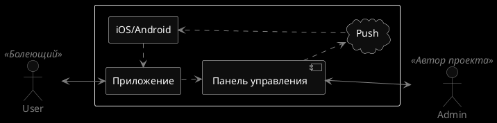
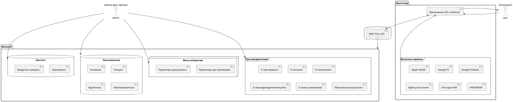
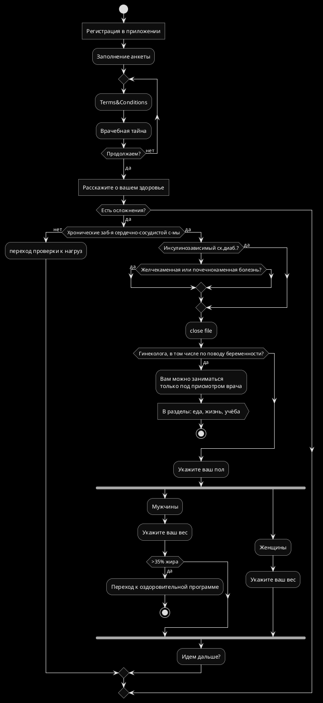

# Headline

> Взаимодействие между пользователями и Авторами

> Компоненты системы

@startuml
' Комментарий в одну строку
Bob->Alice : hello
/' Комментарий в несколько строк '/
@enduml

if (Есть осложнения?) then (да)
elseif (Желчекаменная или почечнокаменная болезнь?) then (да)
    :Вам можно заниматься 
    только под присмотром врача;
    :В разделы: еда, жизнь, учёба>
  stop
elseif (Приступы удашья?) then (да)
    :Вам можно заниматься
    только под присмотром врача;
    :В разделы: еда, жизнь, учёба>
  stop
elseif (Тромбофлебит нижних конечностей?) then (да)
    :Вам можно заниматься
    только под присмотром врача ЛФК;
    :В разделы: еда, жизнь, учёба>
  stop
elseif (Близорукость 7 диоптрий и выше?) then (да)
    :Вам можно заниматься
    только под присмотром врача ЛФК;
    :В разделы: еда, жизнь, учёба>
  stop
elseif (Заболевания крови?) then (да)
    :Вам можно заниматься
    только под присмотром врача ЛФК;
    :В разделы: еда, жизнь, учёба>
  stop

else (нет ограничений)
endif

Яков Иссакиевич Емельянов. Тренер. Отец Ирины Масленниковой.Есть в википедии.
