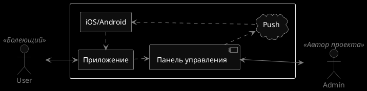
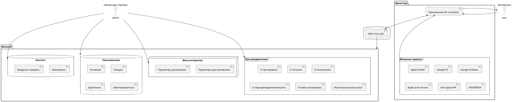
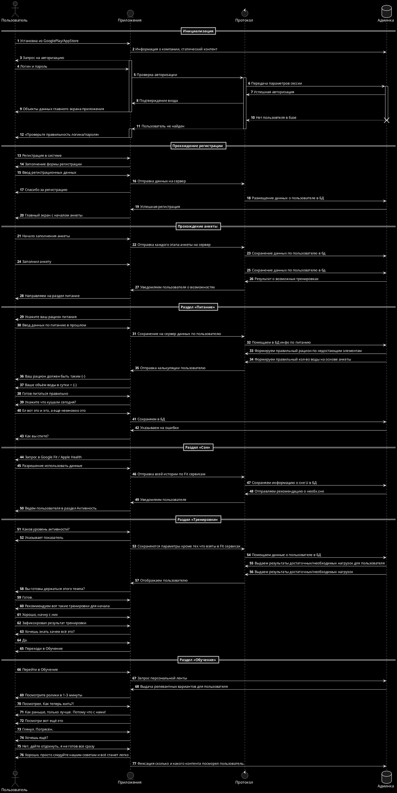
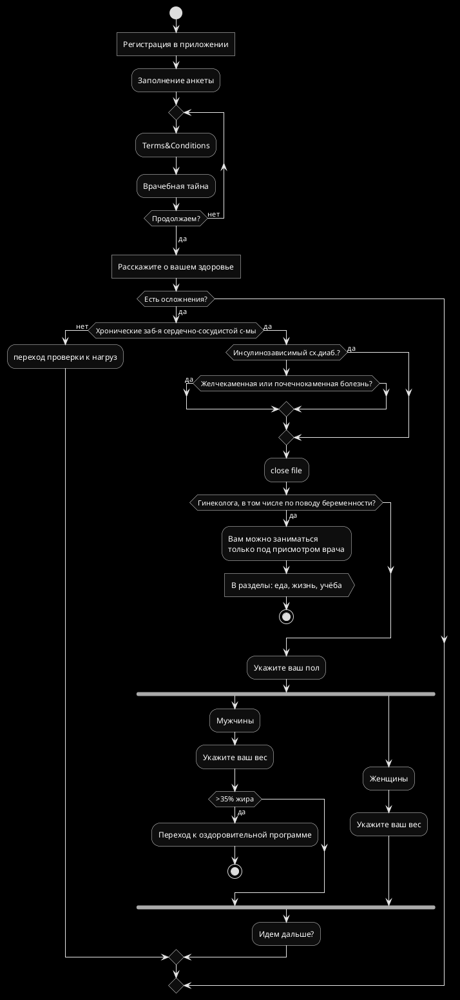

# Проектная документация проекта «Просто, ЗОЖ»

> Находится в разработке. Может меняться до приёмки Автором

## Назначение и цели проекта
Система предназначается для быстрого и качественного обмена информацией между клиентами и собственниками БЦ «JapanHouse».

## Взаимодействие между пользователями и автором

## Диаграмма компонентов системы

## Диаграмма последовательностей пользователей приложения

## Алгоритм проверки в анкете пользователя:

Яков Иссакиевич Емельянов. Тренер. Отец Ирины Масленниковой.Есть в википедии.
