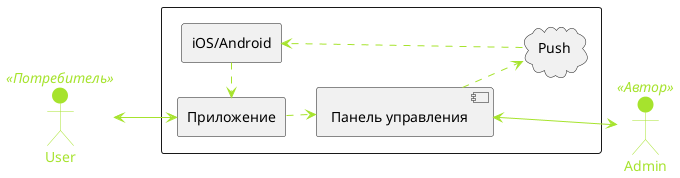
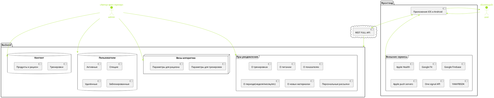
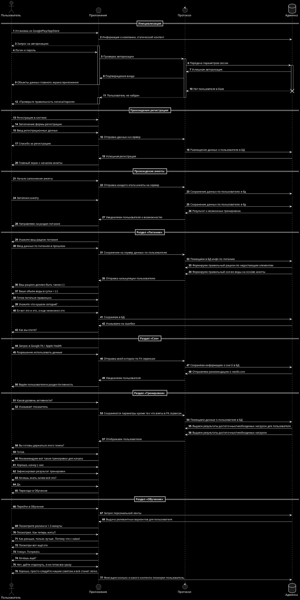
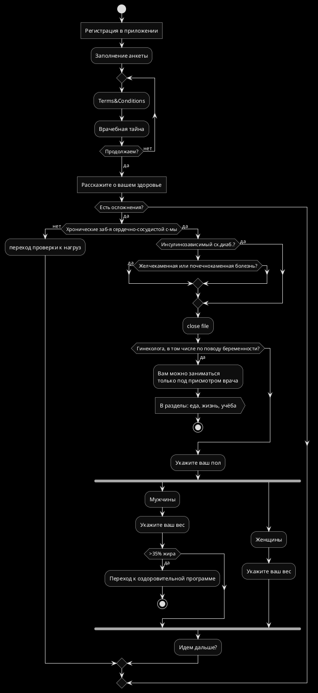

# Проектная документация проекта «Просто, ЗОЖ»

> Находится в разработке. Может меняться до приёмки Автором

## Назначение и цели проекта
Система предназначается для систематизации знаний Автора по вопросу здорового и сбалансированного образа жизни без повышенных требований к потребителю.
После запуска есть цели выйти на просторы СНГ и дальше на международную арену.

*В это место нужно попросить у Автора краткое описание в два-три предложения всей системы. А то я чёт не смог формульнуть.*

### Автор проекта
Масленникова Ирина Яковлевна.

Масленникова Антонина (отчество уточнить надо, забыл)

> Вдохновлены достижениями Якова Иссакиевича Емельянова. Заслуженный тренер. Отец Автора, Ирины Масленниковой. Детали о Я. И. Емельянове есть в Википедии.

## Сценарии использования пользователем
### Взаимодействие между пользователями и автором

## Роли пользователей в системе

> Раздел в доработке

Сценарии использования по роли «Наблюдатель»

Сценарии использования по роли «Соблюдение сна и еды»

Сценарии использования по роли «Соблюдение сна, еды, оздоровляющих тренировок»

Сценарии использования по роли «Соблюдение сна, еды, нагрузочных и круговых тренировок»

## Диаграмма компонентов системы

### Основание для создания технической документации 
Решение Администрации БЦ «JapanHouse», на основе потребности клиентов к мобильному доступу по оказываемым услугам.

## Количество оказываемых услуг

Количество оказываемых услуг: 1 (одна) услуга по поставке и интеграции IT-комплекса в инфраструктуру Заказчика, включающая в себя:
1. Разработку проектной документации IT-комплекса
2. Интеграция с системами сбора фитнес данных через API Google Fit/Apple Health
3. Подготовка дизайна мобильных приложений согласно требований Apple и Google
4. Программирование и вёрстка мобильного нативного приложения для Android под смартфоны
5. Программирование и вёрстка мобильного нативного приложения для iOS под смартфоны
6. Интеграция с системами Remote Push-уведомлений от Apple и Google (**new**)
7. Внедрение статистических инструментов
8. Публикация мобильных приложений в AppStore и Google Play в аккаунте Заказчика
9. Сдачу IT-комплекса на стендах находящихся на территории Заказчика

### Плановые сроки выполнения работ
Сроки начала и окончания работ определяются Договором с Исполнителем, но не более 3 месяцев с включенным периодом тестирования для начальной версии и не более 7 месяцев для расширенной версии.

### Порядок оформления и предъявления результатов работ

Исполнитель: 
1. Готовит документацию по приёмке и методике тестирования
2. Проводит тестирование на своей технической базе 
3. Передает на ознакомление документацию по приёмке Заказчику
4. Проводит совместно с заказчиком приёмку и тестирование на территории Заказчика

Заказчик:
1. Принимает и изучает документацию методики тестирования
2. Проводит тестирование совместно с Исполнителем на территории Заказчика
3. Принимает продукт и подписывает акт приёмки

Приемочные испытания Мобильных приложений проводятся в соответствии с разрабатываемым Исполнителем документом «Программа и методика испытаний», который должен устанавливать необходимый и достаточный объем испытаний, обеспечивающий достоверность получаемых результатов.
Цель приемочных испытаний — проверка соответствия реализации мобильных приложений требованиям, определенным в технической документации.

Приемочные испытания должны состоять из следующих проверок:
- проверка комплектности эксплуатационной документации;
- проверка соответствия технических характеристик МП требованиям настоящей документации.

Процесс разработки и контроля разработки может быть разбит на этапы, указанные в разделе График запуска, включающую в себя перечень этапов, объем работ по каждому этапу, входящие информационные материалы, исходящие материалы, предъявляемые по окончанию соответствующих этапов.

Методы испытаний МП должны включать перечень действий проверки мобильных приложений и описание условий успешности проверки, соответствующих требованиям Технического задания.

Методы испытаний МП должны быть включены Исполнителем в документ «Программа и методика испытаний».

Заказчик назначает дату проведения приемочных испытаний и формирует приемочную комиссию, состоящую из представителей Заказчика. В приемочную комиссию включаются представители Исполнителя.

Заказчик совместно с Исполнителем проводит необходимые подготовительные мероприятия для проведения приемочных испытаний на территории Заказчика. Заказчик предоставляет помещение и технические средства для проведения приемочных испытаний.

Приемочные испытания завершаются подписанием комиссией акта приемочных испытаний.
В случае выявления несоответствий МП отправляется на доработку, которая производится Исполнителем не более чем за 7 рабочих дней, но с корректировкой на сложность необходимых изменений.

### Требования к составу и содержанию работ по подготовке к вводу в эксплуатацию
Перечень работ, выполняемых при подготовке разрабатываемых МП к вводу в эксплуатацию:

1. Представителем со стороны Заказчика должны быть подготовлены и добавлены в систему управления контентом(Админ-панель сайта на Bitrix) информационные материалы, предназначенные для наполнения информационных разделов мобильных приложений. Информационные материалы и изображения должны быть адаптированы для корректного отображения на экранах мобильных устройств. Совместно с Исполнителем определяются параметры информационных материалов.
2. В случае если представитель Заказчика не имеет возможности подготовить материалы в административной панели сайта на Bitrix, то подготавливается отдельным этапом и ресурсоёмкостью после разработки REST API, подготовка материалов Исполнителем.
3. Перед вводом в эксплуатацию МП Исполнитель оказывает содействие в регистрирации аккаунтов для размещения МП на площадках:
  * Apple Store
  * Google Play

На площадках по дистрибуции приложения размещаются Исполнителем. Аккаунты для площадок приобретаются Заказчиком или арендуются у Исполнителя.

### Требования к документированию

Исполнитель разрабатывает и передает Заказчику следующую документацию:
- программа и методика испытаний;
- регламент эксплуатации мобильных приложений;
- руководство администратора мобильных приложений через Админ-панель;
- общее описание системы

Документы должны быть переданы Заказчику на электронном носителе.

### Гарантийные обязательства и техническое сопровождение
Гарантийный срок на работы не ограничен и исчисляется с даты подписания акта сдачи-приемки работ. В течение указанного периода Исполнитель осуществляет полную бесплатную техническую поддержку МП, оперативно устраняет сбои и ошибки в работе МП в случае отсутствия влияния на систему третьих сторон.

Исполнитель в течение гарантийного периода осуществляет подготовку и публикацию обновлений МП.

В случае если после сдачи IT-комплекса Заказчику, третьи стороны не влияли на продукт, то гарантия IT-комплекса со стороны Исполнителя — бессрочна.

Дополнительное техническое обслуживание МП может осуществляться Исполнителем по отдельному договору.

## Окружение и операционные системы
### Стационарные ОС
Не подразумеваются в рамках выполнения работ.
### Мобильные ОС
* Android v8+
* iOS v12+

# Интеграция с внешними сервисами

## Требования к разработке API к взаимному обмену данными по API

1. Синхронизация работы приложения с серверной частью Админ-панель управления контентом
2. Синхронизация приложения с Админ-панелью сайта происходит при каждом подключении приложения (при условии наличии подключения к сети Интернет).

Каждый раз, когда пользователь в приложении вносит какие-либо изменения в личные данные или запрашивает обновления, каталог информации приложения уведомляет об этом сервер и передает или получает данные о внесенных изменениях.

### Технические принципы работы с API
Приложение обменивается информацией с сервером — поставщиком данных. На сервере хранится информация о статусах и действиях пользователя. Получая данную информацию с сервера, приложение сохраняет её в свою внутреннюю базу данных и файловое хранилище, при необходимости обновляя путем соответствующего запроса к серверу.

### Схема обмена информацией
Приложение обращается к серверу через защищенный протокол https (при этом сервер имеет действующий SSL-сертификат). Точкой обращения является конкретный адрес, например: https://domain.ru/api/. Все запросы на сервер отправляются соответстующими методами, при этом данные запросов и ответов передаются в формате JSON.

### Формат API

Подготовкой API занимается Исполнитель.
API должно обеспечить реализацию всего оговоренного в данном документе функционала.

Требования к разрабатываемому API:
- отображение информационных экранов для неавторизованных пользователей
- реализация авторизации без регистрации
- реализация обработки заявок со стороны пользователя
- реализация получения заявок и списка заявок
- реализация методов для remote push notifications (**new**)

Коды ошибок: 

**200** OK — это ответ на успешные GET, PUT, PATCH или DELETE. Этот код также используется для POST, который не приводит к созданию.

**201** Created — этот код состояния является ответом на POST, который приводит к созданию.

**204** Нет содержимого. Это ответ на успешный запрос, который не будет возвращать тело (например, запрос DELETE)

**304** Not Modified — используйте этот код состояния, когда заголовки HTTP-кеширования находятся в работе

**400** Bad Request — этот код состояния указывает, что запрос искажен, например, если тело не может быть проанализировано

**401** Unauthorized — Если не указаны или недействительны данные аутентификации. Также полезно активировать всплывающее окно auth, если приложение используется из браузера

**403** Forbidden — когда аутентификация прошла успешно, но аутентифицированный пользователь не имеет доступа к ресурсу

**404** Not found — если запрашивается несуществующий ресурс

**405** Method Not Allowed — когда запрашивается HTTP-метод, который не разрешен для аутентифицированного пользователя

**410** Gone — этот код состояния указывает, что ресурс в этой конечной точке больше не доступен. Полезно в качестве защитного ответа для старых версий API

**415** Unsupported Media Type. Если в качестве части запроса был указан неправильный тип содержимого

**422** Unprocessable Entity — используется для проверки ошибок

**429** Too Many Requests — когда запрос отклоняется из-за ограничения скорости

**Типы запросов:**

**GET** — для получения данных с сервера

**POST** — для добавления новых данных на сервер

**PUT** — для редактирования данных

**PATCH** — для частичного обновления данных на сервер : например для обновления 1 поля объекта

**DELETE** — для удаления данных на сервере : например, для удаления избранного у пользователя локально

**OPTIONS** — для сложных случаев, когда нельзя предсказать возможные варианты использования после действия пользователя

### Требования к надежности и безопасности приложения
При разработке приложения необходимо предусмотреть защиту от взлома приложения на всех этапах его функционирования:
- локальная работа приложения без связи с сервером;
- работа приложения при синхронизации сервером;

Если пользователь не имеет доступа к сети Интернет, то прилоежние отображет ему окно «Пожалуйста, подключитесь к Интернету» и кнопка «ОК» / «Перейти в Настройки».

Если пользователь забанен или отключен из системы, то его авторизационная сессия на мобильном клиенте завершается.
И пуш-уведомления не приходят для этого пользоватля(**new**).

# Push-notifications в мобильных приложениях

> Раздел в доработке

Для пользователя мобильного приложения с ролью **«Наблюдатель»**: 
- Наименование и тип уведомления
- 
Для пользователя мобильного приложения с ролью **«Соблюдение сна и еды»**: 
- Наименование и тип уведомления
- 
Для пользователя мобильного приложения с ролью **«Соблюдение сна, еды, оздоровляющих тренировок»**: 
- Наименование и тип уведомления
- 

Для пользователя мобильного приложения с ролью **«Соблюдение сна, еды, нагрузочных и круговых тренировок»**: 
- Наименование и тип уведомления
- 

Предлагается провайдер уведомлений: **OneSignal**

Для веб-админ-панели сайта потребуется интеграция через документацию описанную [по ссылке](https://documentation.onesignal.com/docs/web-push-quickstart)  
Для мобильных приложений интеграция через flutter sdk  [по ссылке](https://documentation.onesignal.com/docs/flutter-sdk-setup)

## Сбор статистики

1. Сколько прочитанных Push-уведомлений
2. Сколько раз пользователь в течении дня открывает приложение
3. Сколько времени пользователь в течении дня проводит в приложении
4. На каждый экран при открытии добавляется событие об открытии экрана пользователем
5. Другие события согласованные с Автором

> Тут нужен перечень от Автора

6. Выбранные сервисы для сбора: YandexAppMetricaSDK и FacebookSDK

## Диаграмма последовательностей пользователей приложения

### Git flow и релизная политика
Процедура деплоя после релиза должна работать через согласованный git flow: 
   1. Разработчики инициируют новую фичу путём создания ветки [myfeature] от ветки `develop` 
        Для начала разработки фичи выполняется:
       `git flow feature start MYFEATURE `. Это действие создаёт новую ветку фичи, основанную на ветке "develop", и переключается на неё.
   2. После заверешния работ с новой функциональностью разработчик отправляет ветку на тестирование.  Окончание разработки фичи. Это действие выполняется так: 
    - Слияние ветки MYFEATURE в "develop"
    - Удаление ветки фичи
    - Переключение обратно на ветку "develop"

  Команда: `git flow feature finish MYFEATURE`

   1. В случае успешно пройденного тестирования, разработчик после валидации от тимлида или продюсера делает слияние с веткой `develop`
   2. Ветка `develop` проходит новую итерацию тестирования
   3. Для начала работы над релизом используйте команду `git flow release` Она создаёт ветку релиза, ответляя от ветки "develop".
   4. После прохождения тестирования релиза, происходит слияние ветки `staging` в ветку `release x.x.x.x`, где x = номер релиза. Важное требование: сразу публиковать ветку релиза после создания, чтобы позволить другим разработчиками выполнять коммиты в ветку релиза.    
   5. После успешного релиза — нужно делать слияние в ветку `master`
      * Ветка релиза сливается в ветку "master"
      * Релиз помечается тегом равным его имени
      * Ветка релиза сливается обратно в ветку "develop"
      * Ветка релиза удаляется
    
    Команда `git flow release finish RELEASE `

# Доставка на рынок

### Размещение в Appstore & Google Play
#### Подготовка к публикации
1. Необходимо использовать приобретенный или купить новый аккаунт разработчика для Apple = 100$ ежегодная плата, Google = 25$ с неиссякаемой лицензией. 
2. Подготовка всех скриншотов необходимы к публикации
3. Генерация ключей для подписи приложения перед публикацией в Appstore
4. Генерация `keystore ` должна осуществляться прямо в репозитории проекта. 
5. Необходимо сохранить информацию о паролях и alias-ах в репозитории проекта. 

#### Загрузка в магазины сборок приложений
1. Заполняется информация о будущих мобильных приложениях
2. Загрузка скриншотов и промо-материалов для страницы
3. Загрузка сборки в alpha-channel Google Play и Testflight
4. После тестирования из alpha & Testflight публикация в полную валидацию и релиз в магазины
5. После тестов отправка в продакшн модерацию от Apple и Google

# Требования к дизайну 
1. Логотип по ссылке: [psd](#), [eps, вектор](#). 
2. Из логотипа необходимо сделать иконку. Фон для иконки серый. Код цвета фона #808080, можно [увидеть по ссылке](#). 
3. Фирменные шрифты компании по ссылке: [bold](#), [medium](#), [reuglar](#)
4. Фирменные цвета: [ ] буквы на [] или [] фоне. Без определенных требований к комбинаторике.

## Алгоритм проверки в анкете пользователя:

> Схема ещё в доработке, не доделана, в неё пока можно не вникать :-)

# Мультиязычность проекта

> Нужно обсудить с авторами, стоит ли её закладывать и насколько высока готовность переводить столько контента. Есть вариант делать переводы бесплатно, через носителей и комьюнити :-) 
> Вполне живая схема.

# Интерфейсы пользователя

## Экран «Логина»

**Тип экрана:** динамический контент, получение API

**Бизнес-логика:** 
Экран подразумевает отбражение кратких возможностей в приложении.
Возможность перехода на экран авторизации. 
Возможность перехода на экраны с контентом.

**Отображение данных:**

| Наименование | Тип | Формат| Поставщик | Примечание |
| :--------- | :-----------: | :-----------: | :-----------: | :----------- |
|  |  |  | | |

**Навигация, события, переходы:**

| Элемент | Действие | Статус | Назначение |
| :------ | :--------: | :--------: |:----------- |
|  | Tap | Success | Экран « » |

**Методы REST API:**

| Метод | Тип запроса  | Формат ответа  | Параметры запроса | Дополнительно |
| :--------- | :-----------: | :----------- |:-----------  |:----------- |

## Экраны «Welcome!»

Хелп экраны на котрых вкратце рассказывется, что может приложение и для чего оно в целом. 

## Экраны «Анкеты»
Валидация того, какие разделы пользователю будут доступны. Какую роль он получит после прохождения анкеты.

## Экраны «Отчёт и доступы к разделам»
Проходим анкету на предмет выявления. В конце просим мыло, чтобы отправить на него PDF отчёт.
Для пущей мотивации можно запустить таймер обратного отсчёта со словами: «Мы трепетно относимся к персональным данным. Ваш отчёт самоуничтожится через 3 минуты 59 секунд. Если хотите сохранить полезные советы, мы можем отправить вам это на почту, укажите её ниже:»

## Экраны «Общей навигация в приложении»
Сквозные таббары, меню вызовов, уведомления внутри экранов, ссылки переходов.

## Экраны «Дашборд пользователя»
Три столпа здоровья: режим, еда, движение. 
По каждому столпу сегодняшние показатели. 

- для **Режима** учитываются точка подъёма и точка ухода в сон. 
- для **Еды** учитывается кол-во, объём и тип принятой еды и жидкости.
- для **Движения** учитывается кол-во шагов, тренировок

При тапе на каждый столп, можно перейти в детали конкретного раздела.

## Экраны «Лента знаний, инсайты»

Полезные факты, справочник — динамическая лента с лонгридами и краткими сторис.

## Экраны «Справочинк продуктов»

Перечень продуктов с фильтрацией и динамическим поиском с автоподстановкой во время ввода.
Каждый продукт в себе содержит: перечень состава и кол-во каждого элемента в составе.

## Экраны «Справочник упражнений»

1. Аэробные упражнения для девушек 
2. Аэробные упражнения для юношей
3. Силовые и круговые упражнения для юношей
4. Силовые и круговые упражнения для девушек

Просмотр и запуск тренировок происходит на основе Роли пользователя к уровню сложности.

## Экраны «Профиль и настройки» 
Персональные данные пользователя и настройки приложения. В настройках приложения будут возможность отключения звуков, пуш-уведомлений, удаление профиля, удаление из системы, сброс данных.

## Экраны «Статистика»
Информация о прогрессе пользователя. 
Параметры прогресса: вес, сон, режимность, постоянство в тренировках, полноценность питания.

## Экраны «Системные»
Сюда входят все служебные экраны с информацией об авторах, о методиках, о используемой литературе, о разработчиках, о проекте в целом, о планах развития проекта, о инвесторах проекта(если они хотят), юридическая информация, контакты, реквизиты, форма обратной связи с Авторами проекта.
