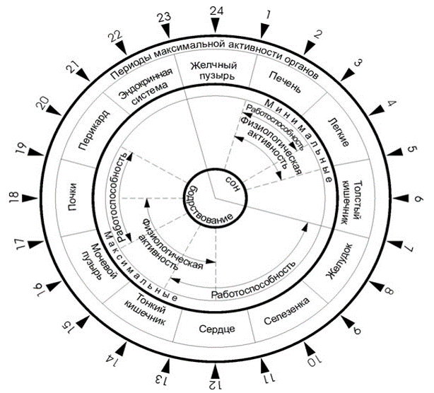
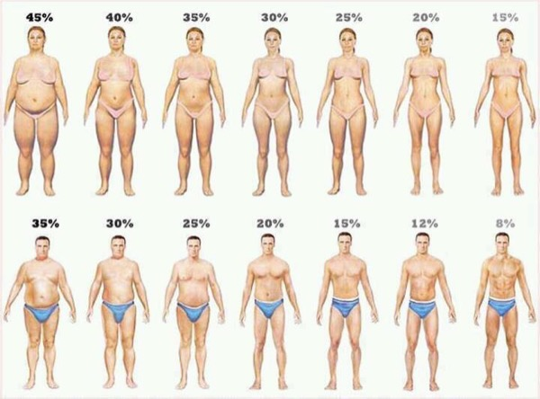
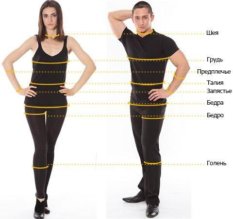
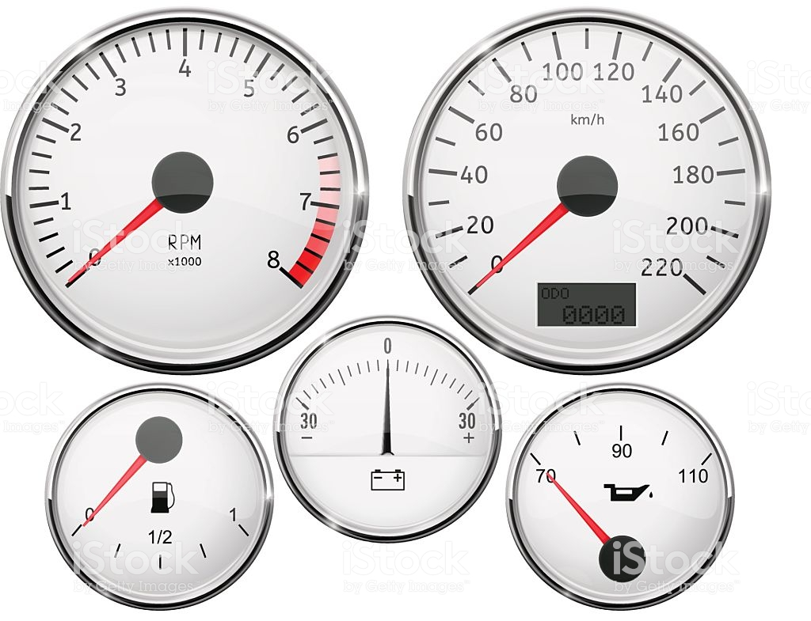
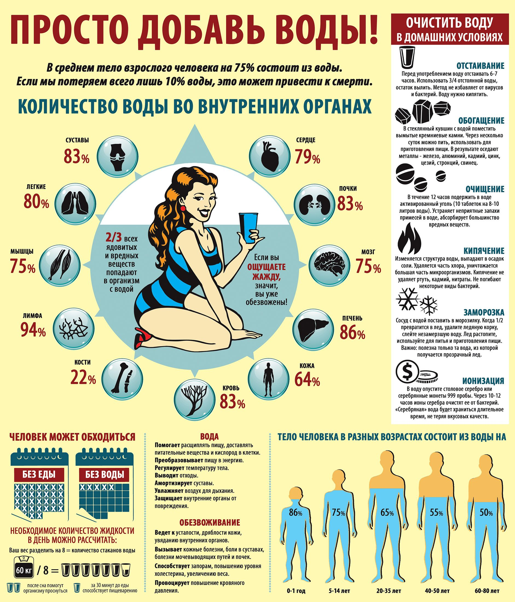
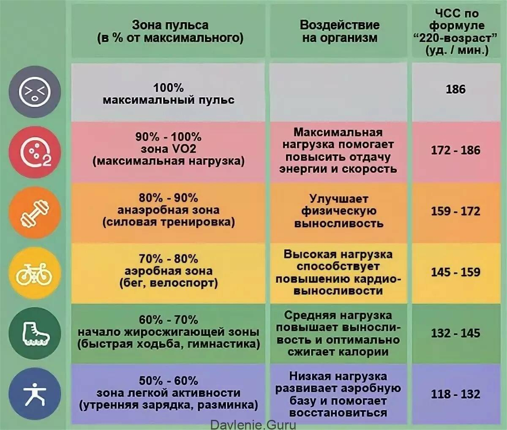

# Проектная документация проекта «Просто, ЗОЖ»

 
Приёмка дизайна, коррекция требований от 01.06.2020

 

1. Тесты запускаются после зонтика конкретного типа. А первичные запросы на старте регистрации

2. Режим дня переделать в формат двух часов. Один циферблат под НОЧЬ, второй циферблат под ДЕНЬ. У циферблатов должен быть режим при тапе с инструментом лупы, когда можно для задержки указывать более точные деления у часов. 

[!](/i/clocks.jpeg)

   2.1 У каждой тренировки есть возможность указать перенос в течении дня или на другой день в попапе при тапе на зону тренировки у циферблата. 

3. К режиму дня прикручиваем отображение с курением. 

[!](/i/smoke.jpeg)

4. По пульсу и графику зон, где есть отображение циклов. Всё в комментариях FIGMA.

5. Для каталога продуктов, нужно использовать иконки для разделов. В итоге получится не 300 иконок, а по кол-ву разделов(что сильно меньше отрисовки даёт).

>Приёмка первой части чистового дизайна 29.04.2020.
>Пометки:

1. На экране Help1
   - убрать многоточие
   - выделить размером слово ЗОЖ
   - можно подумать в сторону увеличения размера описания текста к хелпу, если позволяет пространство для конкретного экрана
2. Экран Help2
   - неверная иллюстрация
   - Символы тестирования:
     - сантиметровая лента
     - секундомер
     - тонометр
     - опросник с галочками
     - фигура полная и худая
3. Экран 0.15.fuctional_test
   - иконка пользователя и ЗОЖ сносится, облака ЗОЖ и пользователя выделяются цветом
   - корректировка текста у первого абзаца
   - таймер нужно сделать вертикальной полосой, в стиле материал песочных часов
4. Dashboard
   - текст прогресса делаем более акцентированным(BOLD/BLACK) или цвет, сейчас нижние выбиваются относительно надписей на диаграмме
   - перенос текста в конец после завершения полосы, так как это мешает внутреннему перфекционисту Антонины
   - нужно сделать кнопки серыми под фон, бордер толщиной с полосу на диаграмме, под эквивалентный цвет
   - текст на диаграмме весь белый, без лишнего опасити
5. Экран добавления зонтик
   - проверить цвета и кнопки на фоне под блюром
   - фиолетовый цвет для режима_сна
6. Экран добавления еды
   - для каждого контейнера не нужно выводить воду, вода должна быть отдельным контейнером может быть как такая бутылочка вверху. и все приемы пищи и воды вливаются в одну «канистру»
   - также нужно выделить отдельно нутриенты, как и вода
   - калории вообще не нужны, сносим их везде кроме экрана просмотра продуктов в каталоге продуктов
   - у говядины нужно переместить местами. Т.е. группа это красное мясо, и подвид в виде говядины/или свинины/ или баранины
   - 

 
 Первичные вводные проектной документации
 

## Назначение и цели проекта 
Целями проекта является обучение теоретическим основам и практическим навыкам:
- здорового образа жизни и его организации;
- правильного планирования физической нагрузки  для получения оздоровительного эффекта на организм;
- исключения факторов риска сердечнососудистых  и онкологических заболеваний;
- рационального питания;
- методам предупреждения психических перенапряжений;

Всё вместе это является инструментом профилактики здоровья людей и увеличения его количества.

### Автор проекта

Масленникова Антонина.
Масленникова Ирина.

### Прототипы ключевых экранов приложения

<!-- > Вдохновлены достижениями Якова Иссакиевича Емельянова. Заслуженный тренер. Отец Автора, Ирины Масленниковой. Детали о деятельности Я. И. Емельянове есть в Википедии. -->

## Сценарии использования пользователем
### Взаимодействие между пользователями и автором

## Роли пользователей-потребителей в системе

1. «Наблюдатель»
2. «Регуляция режима и питания»
3. «Регуляция режима, питания и оздоровительных тренировок»
4. «Регуляция режима, питания, нагрузочных и круговых тренировок»

## Диаграмма компонентов системы

## Количество оказываемых услуг

Количество оказываемых услуг: 1 (одна) услуга по поставке и интеграции IT-комплекса в инфраструктуру Заказчика, включающая в себя:
1. Разработку проектной документации IT-комплекса
2. Интеграция с системами сбора фитнес данных через API Google Fit/Apple Health
3. Подготовка дизайна мобильных приложений согласно требований Apple и Google
4. Программирование и вёрстка мобильного нативного приложения для Android под смартфоны
5. Программирование и вёрстка мобильного нативного приложения для iOS под смартфоны
6. Интеграция с системами Remote Push-уведомлений от Apple и Google (**new**)
7. Внедрение статистических инструментов
8. Публикация мобильных приложений в AppStore и Google Play в аккаунте Заказчика
9. Сдачу IT-комплекса на стендах находящихся на территории Заказчика

### Плановые сроки выполнения работ
Сроки начала и окончания работ определяются Договором с Исполнителем, но не более 3 месяцев с включенным периодом тестирования для начальной версии и не более 7 месяцев для расширенной версии.

### Порядок оформления и предъявления результатов работ

Исполнитель:
1. Готовит документацию по приёмке и методике тестирования
2. Проводит тестирование на своей технической базе
3. Передает на ознакомление документацию по приёмке Заказчику
4. Проводит совместно с заказчиком приёмку и тестирование на территории Заказчика

Заказчик:
1. Принимает и изучает документацию методики тестирования
2. Проводит тестирование совместно с Исполнителем на территории Заказчика
3. Принимает продукт и подписывает акт приёмки

Приемочные испытания Мобильных приложений проводятся в соответствии с разрабатываемым Исполнителем документом «Программа и методика испытаний», который должен устанавливать необходимый и достаточный объем испытаний, обеспечивающий достоверность получаемых результатов.
Цель приемочных испытаний — проверка соответствия реализации мобильных приложений требованиям, определенным в технической документации.

Приемочные испытания должны состоять из следующих проверок:
- проверка комплектности эксплуатационной документации;
- проверка соответствия технических характеристик МП требованиям настоящей документации.

Процесс разработки и контроля разработки может быть разбит на этапы, указанные в разделе График запуска, включающую в себя перечень этапов, объем работ по каждому этапу, входящие информационные материалы, исходящие материалы, предъявляемые по окончанию соответствующих этапов.

Методы испытаний МП должны включать перечень действий проверки мобильных приложений и описание условий успешности проверки, соответствующих требованиям Технического задания.

Методы испытаний МП должны быть включены Исполнителем в документ «Программа и методика испытаний».

Заказчик назначает дату проведения приемочных испытаний и формирует приемочную комиссию, состоящую из представителей Заказчика. В приемочную комиссию включаются представители Исполнителя.

Заказчик совместно с Исполнителем проводит необходимые подготовительные мероприятия для проведения приемочных испытаний на территории Заказчика. Заказчик предоставляет помещение и технические средства для проведения приемочных испытаний.

Приемочные испытания завершаются подписанием комиссией акта приемочных испытаний.
В случае выявления несоответствий МП отправляется на доработку, которая производится Исполнителем не более чем за 7 рабочих дней, но с корректировкой на сложность необходимых изменений.

### Требования к составу и содержанию работ по подготовке к вводу в эксплуатацию
Перечень работ, выполняемых при подготовке разрабатываемых МП к вводу в эксплуатацию:

1. Представителем со стороны Заказчика должны быть подготовлены и добавлены в систему управления контентом информационные материалы, предназначенные для наполнения информационных разделов мобильных приложений. Информационные материалы и изображения должны быть адаптированы для корректного отображения на экранах мобильных устройств. Совместно с Исполнителем определяются параметры информационных материалов.
2. В случае если представитель Заказчика не имеет возможности подготовить материалы в административной панели сайта, то подготавливается отдельным этапом и ресурсоёмкостью после разработки REST API, подготовка материалов Исполнителем.
3. Перед вводом в эксплуатацию МП Исполнитель оказывает содействие в регистрирации аккаунтов для размещения МП на площадках:
  * Apple Store
  * Google Play

На площадках по дистрибуции приложения размещаются Исполнителем. Аккаунты для площадок приобретаются Заказчиком или арендуются у Исполнителя.

### Требования к документированию

Исполнитель разрабатывает и передает Заказчику следующую документацию:
- программа и методика испытаний;
- регламент эксплуатации мобильных приложений;
- руководство администратора мобильных приложений через Админ-панель;
- общее описание системы

Документы должны быть переданы Заказчику на электронном носителе.

### Гарантийные обязательства и техническое сопровождение
Гарантийный срок на работы не ограничен и исчисляется с даты подписания акта сдачи-приемки работ. В течение указанного периода Исполнитель осуществляет полную бесплатную техническую поддержку МП, оперативно устраняет сбои и ошибки в работе МП в случае отсутствия влияния на систему третьих сторон.

Исполнитель в течение гарантийного периода осуществляет подготовку и публикацию обновлений МП.

В случае если после сдачи IT-комплекса Заказчику, третьи стороны не влияли на продукт, то гарантия IT-комплекса со стороны Исполнителя — бессрочна.

Дополнительное техническое обслуживание МП может осуществляться Исполнителем по отдельному договору.

## Окружение и операционные системы
### Стационарные ОС
Не подразумеваются в рамках выполнения работ.
### Мобильные ОС
* Android v8+
* iOS v12+

# Интеграция с внешними сервисами

## Требования к разработке API к взаимному обмену данными по API

1. Синхронизация работы приложения с серверной частью Админ-панель управления контентом
2. Синхронизация приложения с Админ-панелью сайта происходит при каждом подключении приложения (при условии наличии подключения к сети Интернет).

Каждый раз, когда пользователь в приложении вносит какие-либо изменения в личные данные или запрашивает обновления, каталог информации приложения уведомляет об этом сервер и передает или получает данные о внесенных изменениях.

### Технические принципы работы с API
Приложение обменивается информацией с сервером — поставщиком данных. На сервере хранится информация о статусах и действиях пользователя. Получая данную информацию с сервера, приложение сохраняет её в свою внутреннюю базу данных и файловое хранилище, при необходимости обновляя путем соответствующего запроса к серверу.

### Схема обмена информацией
Приложение обращается к серверу через защищенный протокол https (при этом сервер имеет действующий SSL-сертификат). Точкой обращения является конкретный адрес, например: https://domain.ru/api/. Все запросы на сервер отправляются соответстующими методами, при этом данные запросов и ответов передаются в формате JSON.

### Формат API

Подготовкой API занимается Исполнитель.
API должно обеспечить реализацию всего оговоренного в данном документе функционала.

Требования к разрабатываемому API:
- отображение информационных экранов для неавторизованных пользователей
- отображение и обработка экранов для авторизованных пользователей
- реализация методов для remote push notifications

Коды ответов сервера:

**200** OK — это ответ на успешные GET, PUT, PATCH или DELETE. Этот код также используется для POST, который не приводит к созданию.

**201** Created — этот код состояния является ответом на POST, который приводит к созданию.

**204** Нет содержимого. Это ответ на успешный запрос, который не будет возвращать тело (например, запрос DELETE)

**304** Not Modified — используйте этот код состояния, когда заголовки HTTP-кеширования находятся в работе

**400** Bad Request — этот код состояния указывает, что запрос искажен, например, если тело не может быть проанализировано

**401** Unauthorized — Если не указаны или недействительны данные аутентификации. Также полезно активировать всплывающее окно auth, если приложение используется из браузера

**403** Forbidden — когда аутентификация прошла успешно, но аутентифицированный пользователь не имеет доступа к ресурсу

**404** Not found — если запрашивается несуществующий ресурс

**405** Method Not Allowed — когда запрашивается HTTP-метод, который не разрешен для аутентифицированного пользователя

**410** Gone — этот код состояния указывает, что ресурс в этой конечной точке больше не доступен. Полезно в качестве защитного ответа для старых версий API

**415** Unsupported Media Type. Если в качестве части запроса был указан неправильный тип содержимого

**422** Unprocessable Entity — используется для проверки ошибок

**429** Too Many Requests — когда запрос отклоняется из-за ограничения скорости

**Типы запросов:**

**GET** — для получения данных с сервера

**POST** — для добавления новых данных на сервер

**PUT** — для редактирования данных

**PATCH** — для частичного обновления данных на сервер : например для обновления 1 поля объекта

**DELETE** — для удаления данных на сервере : например, для удаления избранного у пользователя локально

**OPTIONS** — для сложных случаев, когда нельзя предсказать возможные варианты использования после действия пользователя

### Требования к надежности и безопасности приложения
При разработке приложения необходимо предусмотреть защиту от взлома приложения на всех этапах его функционирования:
- локальная работа приложения без связи с сервером;
- работа приложения при синхронизации сервером;

Если пользователь не имеет доступа к сети Интернет, то прилоежние отображет ему окно «Пожалуйста, подключитесь к Интернету» и кнопка «ОК» / «Перейти в Настройки».

Если пользователь забанен или отключен из системы, то его авторизационная сессия на мобильном клиенте завершается.

# Push-notifications в мобильных приложениях

> Раздел в доработке

Для пользователя мобильного приложения с ролью **«Наблюдатель»**:
- Наименование и тип уведомления

Для пользователя мобильного приложения с ролью **«Соблюдение сна и еды»**:
- Наименование и тип уведомления
  
Для пользователя мобильного приложения с ролью **«Соблюдение сна, еды, оздоровляющих тренировок»**:
- Наименование и тип уведомления
  

Для пользователя мобильного приложения с ролью **«Соблюдение сна, еды, нагрузочных и круговых тренировок»**:
- Наименование и тип уведомления
  

Предлагается провайдер уведомлений: **OneSignal**

Для веб-админ-панели сайта потребуется интеграция через документацию описанную [по ссылке](https://documentation.onesignal.com/docs/web-push-quickstart)  
Для мобильных приложений интеграция через flutter sdk  [по ссылке](https://documentation.onesignal.com/docs/flutter-sdk-setup)

## Сбор статистики

1. Сколько прочитанных Push-уведомлений
2. Сколько раз пользователь в течении дня открывает приложение
3. Сколько времени пользователь в течении дня проводит в приложении
4. На каждый экран при открытии добавляется событие об открытии экрана пользователем
5. Другие события согласованные с Автором, но не более 10 пользовательских событий
6. Выбранные сервисы для сбора: YandexAppMetricaSDK и FacebookSDK

## Диаграмма последовательностей пользователей приложения

### Git flow и релизная политика
Процедура деплоя после релиза должна работать через согласованный git flow:
1. Разработчики инициируют новую фичу путём создания ветки [myfeature] от ветки `develop` . Для начала разработки фичи выполняется:
`git flow feature start MYFEATURE `. Это действие создаёт новую ветку фичи, основанную на ветке "develop", и переключается на неё.
2. После заверешния работ с новой функциональностью разработчик отправляет ветку на тестирование.  Окончание разработки фичи. Это действие выполняется так:
    - Слияние ветки MYFEATURE в "develop"
    - Удаление ветки фичи
    - Переключение обратно на ветку "develop"

  Команда: `git flow feature finish MYFEATURE`

1. В случае успешно пройденного тестирования, разработчик после валидации от тимлида или продюсера делает слияние с веткой `develop`
2. Ветка `develop` проходит новую итерацию тестирования
3. Для начала работы над релизом используйте команду `git flow release` Она создаёт ветку релиза, ответляя от ветки "develop".
4. После прохождения тестирования релиза, происходит слияние ветки `staging` в ветку `release x.x.x.x`, где x = номер релиза. Важное требование: сразу публиковать ветку релиза после создания, чтобы позволить другим разработчиками выполнять коммиты в ветку релиза.
5. После успешного релиза — нужно делать слияние в ветку `master`
  * *Ветка релиза сливается в ветку "master*"
  * Релиз помечается тегом равным его имени
  * Ветка релиза сливается обратно в ветку "develop"
  * Ветка релиза удаляется
    
    Команда `git flow release finish RELEASE `

# Доставка на рынок

### Размещение в Appstore & Google Play
#### Подготовка к публикации
1. Необходимо использовать приобретенный или купить новый аккаунт разработчика для Apple = 100$ ежегодная плата, Google = 25$ с неиссякаемой лицензией. 
2. Подготовка всех скриншотов необходимы к публикации
3. Генерация ключей для подписи приложения перед публикацией в Appstore
4. Генерация `keystore ` должна осуществляться прямо в репозитории проекта. 
5. Необходимо сохранить информацию о паролях и alias-ах в репозитории проекта. 

#### Загрузка в магазины сборок приложений
1. Заполняется информация о будущих мобильных приложениях
2. Загрузка скриншотов и промо-материалов для страницы
3. Загрузка сборки в alpha-channel Google Play и Testflight
4. После тестирования из alpha & Testflight публикация в полную валидацию и релиз в магазины
5. После тестов отправка в продакшн модерацию от Apple и Google

# Требования к дизайну
1. Логотип по ссылке: [psd](#), [eps, вектор](#).
2. Из логотипа необходимо сделать иконку. Фон для иконки [ ]. Код цвета фона #808080, можно [увидеть по ссылке](#).
3. Фирменные шрифты компании по ссылке: [bold](#), [medium](#), [reuglar](#)
4. Фирменные цвета: [ ] буквы на [ ] или [ ] фоне. Без определенных требований к комбинаторике.

# Мультиязычность проекта

Первая версия только на русском языке.

## Интерфейсы пользователя

### Экран «Логина»

**Тип экрана:** динамический контент, получение API

**Бизнес-логика:**
Экран подразумевает отбражение кратких возможностей в приложении.
Возможность перехода на экран авторизации.
Возможность перехода на экраны с контентом.

**Отображение данных:**

| Наименование | Тип | Формат| Поставщик | Примечание |
| :--------- | :-----------: | :-----------: | :-----------: | :----------- |
|  |  |  | | |

**Навигация, события, переходы:**

| Элемент | Действие | Статус | Назначение |
| :------ | :--------: | :--------: |:----------- |
|  | Tap | Success | Экран « » |

**Методы REST API:**

| Метод | Тип запроса  | Формат ответа  | Параметры запроса | Дополнительно |
| :--------- | :-----------: | :----------- |:-----------  |:----------- |

## Экраны «Welcome!»

Хелп экраны на котрых вкратце рассказывется, что может приложение и для чего оно в целом.

## «Авторизация регистрация»
      1. Экран загрузки приложения с анимацией
      2. Регистрация
      3. Авторизация
      4. Восстановление пароля
      5. Переход на экран «О проекте»

## Экраны «Анкеты»
Валидация того, какие разделы пользователю будут доступны. Какую роль он получит после прохождения анкеты.

1. Экран Общие вопросы о пользователе
   1. Пол
   2. Возраст
2. Экран Вопросы об ограничениях медицинских
3. Экран Вопросы о питании
   1. Перечень продуктов и частотность употребления
4. Экран Вопросы по качеству жизни
   1.   Вы курите?
        - эпизодически
        - регулярно
   2. Бывает ли что Вы:
      - страдаете бессонницей?
      - часто пребываете в состоянии стресса?
      - легко раздражаетесь и выходите из себя в житейских ситуациях?
      - чувствуете беспричинную тревогу?
      - опасаетесь за своё здоровье?
      - быстро утомляетесь?
      - с трудом входите в необходимый рабочий режим?
    1. Сколько часов вы спите обычно?
       1. Нарисовать часы, выбора стрелки начала и стрелки конца сна
       2. Информация о сне, инфографика
          
          
    2. Пользуетесь ли вы будильникам?
       1. Часто
       2. Иногда
       3. Не пользуюсь будильником
    3. Регулярный(ежедневный) ли у вас стул?
       1. Да
          1. В какое время?
             1. Утром
             2. Днём
             3. Вечером
       2. Нет
5. Экран «Вопросы об активности»
   1. Укажите свой вес в КГ
   2. Кол-во упражнений в период времени
      1. Цели которые ставит пользователь перед собой (множественный выбор)
         1. Похудеть
            1. Какой у вас процент жиротложения? 
            2. Какая у вас тип жироотложения? 
         2. Увеличить мышечную массу(множественный выбор)
            1. Верх
            2. Низ
            3. Сделайте замеры вашего организма 
               1. Следующий замер будет через 2 месяца
         3. Повысить уровень здоровья
   3. Функциональный тест
      1. Если пользователь не может его пройти, он пропускает
      2. Не рекомендуем проходить тест, если вы недавно покурили
      3. *Flow*:
         1. Замерьте пульс в покое *15 секунд * 4, и укажите в приложении*
         2. Измерьте давление в покое *после 2-3х минут в покое* (ссылка на видео, как это делать)
         3. Сделайте 20 приседаний, в темпе 1 секунда 1 движение(вниз) 1 секунда(вверх)
         4. Измерьте пульс
         5. Измерьте давление
         6. В конце каждой минуты восстановления после теста, замеряйте пульс и давление до момента полного восстановления
            1. Запуск секундомера для ввода значений
            2. Каждую минуту указывайте пульс
            3. Каждую минуту указывайте верхнее давление
            4. Каждую минуту указывайте нижнее давление
      4. Если пользователь понимает, что прошёл функциональный тест неправильно, то у него есть кнопка прохождения функционального теста «Заново»

## Экраны «Отчёт и доступы к разделам»
Проходим анкету на предмет выявления. В конце просим мыло, чтобы отправить на него PDF отчёт.
Для пущей мотивации можно запустить таймер обратного отсчёта со словами: «Мы трепетно относимся к персональным данным. Ваш отчёт самоуничтожится через 3 минуты 59 секунд. Если хотите сохранить полезные советы, мы можем отправить вам это на почту, укажите её ниже:»
   1. Краткая сводка: показатели вашего организма
   2. Полный отчёт-анализ с рекоммендациями, будет отправлен вам на почту/телефон (если укажет эти данные)
      1. Вместе с отчётом передаются данные для входа в систему:логин и пароль на указанный канал связи
      2. Пример иллюстрации отчёта(это просто пример из другой сферы):
      3. Отчёт уходящий на почту
         
         
         1. Напоминание о том, как выявлять онкологию 
         2. Рекомендуем пройти диспансеризацию  
        

## Экраны «Общей навигация в приложении»
Сквозные таббары, меню вызовов, уведомления внутри экранов, ссылки переходов.

## Экраны «Дашборд пользователя»
Три столпа здоровья: режим, еда, движение.
По каждому столпу сегодняшние показатели.

Необходима общая шкала состояния на **СЕГОДНЯ** 
*Нужно получить материалы о том, как конкретный спидометр называется, какая шкала у каждого из них от Авторов*

- для **Режима** учитываются точка подъёма и точка ухода в сон.
- для **Питание** учитывается кол-во, объём и тип принятой еды и жидкости.
- для **Движения** учитывается кол-во шагов, тренировок

При тапе на каждый столп, можно перейти в детали конкретного раздела.

Для экранов **Режим «Жить»**:

   1. Запрос на получение данных о сне из Apple Health, Google Fit
   2. Укажи сколько было сна сегодня?
      1. На стрелках часов, выбор старт сна
      2. На стрелках часов указать конец сна
   3. Был ли сон у вас дневной 15 минутный сон?
      1. Да
      2. Нет
   4. Качество вашего сна сегодня:
   5. Опрос по сну, каждый день(качество и здоровье сна)
      1. *Вопросы будут предоставлены от Авторов*
   6. Рекоммендации по режиму дня(их 3 вида: простой, похудение, силовой)
      1. Подъем
      2. Завтрак
      3. Перекус
      4. Обед
      5. Обеденный перерыв
      6. 15 минутный сон
      7. Тренировки
      8. Ужин
      9. Второй ужин, простокваша мечниковская :-)
      10. Сон

Для экранов **«Питание»**:
- Кнопка «Чего сегодня съедено/выпито?»
   - Ввод названия продукта с автоподсказкой из каталога
   - Ввод кол-ва порций употребленного продукта
- Помощь с пояснениями на экране «Отображение сетки элементов и частотности приёма»

   - На основе выбранной задачи Пользователя, построение таблицы происходит из программы
      - Для похудения сокращение объема употребляемой еды
      - Для поддержания по норме
      - Для увеличения мышечной массы
   - Параметры питания задаются из административной панели
- Если пользователь где-то упускает или переедает, отображается параметр «ОЙ» на шкале-сетке элементов
   - Как пить воду
      

Для экранов **«Движение»**:
  1. Повседневная нагрузка, моцион
  2. Необходимо указать шагов пройденных
  3. Если не знаете кол-во шагов, укажите сколько времени вы шли пешком. *Приложение автоматически считает кол-во расстояния/шагов из общей средней скорости человка.*
  4. Сколько «двигательных переменок» в течении дня? *Напоминание в течении рабочего дня*
  5. Это могут быть минимум 12-15 минут
     1. Пешком пройтись, размеренно, чтобы не вспотеть
     2. Пешком пройтись, чтобы стало тепло
     3. Желательно на улице
     4. Или размеренно по лестнице в течении 12 минут, чтобы не вспотеть
     5. И не менее 30 минут на свежем воздухе, для получения ультрафиолета
  6. Специальная нагрузка, тренировка 
  7. Зоны  
     1. Определение зоны по формуле: *220-возраст * 0.7* = нужная пульсовая зона
  8. Указать свою тренировку(поставить галочку)
  9.  Выбрать тренировку в приложении
     1. Пройти тренировку в приложении

## Экраны «Лента знаний, инсайты»

Полезные факты, справочник — динамическая лента с лонгридами, видео, фильмами и краткими сторис.

### Перечень элементов на экранах

   1. Сторис
      1. Много изображений
      2. Мало текста
      3. Анимации
      4. Смайлы, обилие
   2. Посты
      1. Статья на 2-3 абзаца
      2. 1-2 изображений
   3. Детальные материалы(лонгриды)
      1. Статья на ∞ абзацев
      2. Обилие изображений
      3. Анимация элементов
      4. Вставки видороликов/2-3 мин
   4. Инфографика
      1. Обилие статистики
      2. Красивая упаковка плоского дизайна, отрисовка в векторе
   5. Видеоролики
      1. Снятые у нас в студии
      2. Найденные и согласованные с авторами в Сети
      3. Видеоролики — не больше 5 минут
   6. Обучающие фильмы
      1. Научные
      2. Познавательные
      3. Фильмы — видеоролик свыше 5 минут уже фильм

## Экраны «Справочинк продуктов»

Перечень продуктов с фильтрацией и динамическим поиском с автоподстановкой во время ввода.
Каждый продукт в себе содержит: перечень состава и кол-во каждого элемента в составе.

Элементы экранов:
   1. Поиск глобальный (автокомлиты)
   2. Фильтрация/сортировка результатов поиска
   3. Категории продуктов
      1. Подкатегории продуктов
   4. Категории необх. элементов
      1. Перечень всех элементов
         1. Просмотр продуктов по элементу
   5. Экран просмотра продукта
      1. Название
      2. Необходимая порция на 1 день
         1. Ладонь
         2. Принцип 4х
         3. Ложки
      3. Вес. Значение динамическое, вычисляется на основе веса указаного пользователем, гендера, роста. В исходной БД лежит всегда по 100гр.
      4. Содержание элементов в указанном весе
         1. Элемент, г
         2. Нутриент, г
         3. Микро, г
         4. Макро, г
         5. Вода, г
   6. Экран «Справочник E-элементов в продуктах»
      1. Ввод в поисковое поле
         1. Автоподсказки
      2. Отображение деталей по E-консерванту-элементу
         1. Статус запрещено, разрешено, допустимо
         2. Влияние на организм человека
         3. Влияние на системы организма(если есть детали)
         4. Влияние на орган человека(если есть детали)

## Экраны «Справочник упражнений»

1. Аэробные упражнения для девушек
2. Аэробные упражнения для юношей
3. Силовые и круговые упражнения для юношей
4. Силовые и круговые упражнения для девушек

### Перечень элементов на экранах

1. Поиск глобальный(автокомплиты)
2. Фильтрация и сортировка
3. По типу задач
  1. Набор мышечной массы
  2. Похудение
  3. Сохранение и поддержание здоровья
  4. Оздоровительные(ЛФК)
4. По принципу построения тренировки
  1. Аэробная
   1. Сверху-вниз
   2. Проблемные зоны
   3. Круговая
  2. Силовая
   4. Верх+середина тела
   5. Низ+середина тела
   6. Круговая
5. Просмотр тренировки
6. Название тренировки
7. Видеоматериал тренировки
8. Краткое описание тренировки
9. Включить трекинг пульса
  1. Через съём данных с пульсометра
   1. Работа с API/Bluetooth считывание напрямую к производителю
  2. Снимать не реже чем 1 раз в 5 минут
  3. Проверить считывание через AppleHealth/GoogleFit или других приложений
10. Выдача результатов и рекомендаций на основе графика динамики пульса в течении тренировки.

Просмотр и запуск тренировок происходит на основе Роли пользователя к уровню сложности.

## Экраны «Профиль и настройки»
Персональные данные пользователя и настройки приложения. В настройках приложения будут возможность отключения звуков, пуш-уведомлений, удаление профиля, удаление из системы, сброс данных.

## Экраны «Статистика»
Информация о прогрессе пользователя.
Параметры прогресса: вес, сон, режимность, постоянство в тренировках, полноценность питания.

## Экраны «Системные»
Сюда входят все служебные экраны с информацией об авторах, о методиках, о используемой литературе, о разработчиках, о проекте в целом, о планах развития проекта, о инвесторах проекта(если они хотят), юридическая информация, контакты, реквизиты, форма обратной связи с Авторами проекта.

### Экраны «Настроек»
1. Отключение пуш-уведомлений(в т.ч. на главном экране): отключение по разным типам пуш-уведомлений
2. Тема: светлая/тёмная
3. Звук: отключение звуковых схем при нажатии на элементы в разных экранах
4. Выбор интересующих тем для экрана Ленты
5. Профиль: редактирование
6. Доступ по 4х-значному коду: ВКЛ/ВЫКЛ

### Экран «О проекте»
1. Общее описание
2. Контакты авторов
3. Информация о разработке проекта

### Экраны «Юридической/правовая информации»
1. Документы по обработке персональных данных
2. Ссылки на литературу и исследования, которые

### Экраны «Технической поддержки»
1. Форма обратной связи
2. Контакты разработки

## Страницы интерфейса «Лендинг посадочная страница»
Одностраничный сайт, на котором в кратце перечисляются возможности приложений и всего комплекса, реквизиты организации, контакты, краткие данные по методикам работы.
Может иметь ссылку вида: *promo.domain.ru*

## Страницы интерфейса «Административная панель»
На первый взгляд там будет след. перечень:
1. Логин
2. Управление пользователями
3. Управление лентой инсайтов
4. Управление справочником продуктов
5. Управление справочником тренировок
6. Управление параметрами влияния на анкету
7. Управление контентом лендинга посадочной страницы

Может иметь ссылку: *admin.domain.ru*

# Интерфейсы мобильных приложений

## Таблица статусов

| Версия продукта | Наименование раздела                              | Кол-во экранов | Статус подготовки дизайна | Документация | Оценка разработки iOS + Android | Оценка разработки backend + api | Комментарий                                                                                              |
| --------------- | ------------------------------------------------- | -------------- | ------------------------- | ------------ | ------------------------------- | ------------------------------- | -------------------------------------------------------------------------------------------------------- |
| 0.5             | Инициация, тестирование                           | 14 (20)        | Nope                      | Done         |                                 |                                 | Требует доработки дизайна экранов входа, экранов просмотра процесса чат-бот режима, экранов регистрации. |
| 0.5             | Дашборд, лента материалов, Share-контента         | 4              | Done                      | Progress     |                                 |                                 |                                                                                                          |
| 0.5             | Трекинг режима                                    | 3              | Done                      | Progress     |                                 |                                 |                                                                                                          |
| 0.5             | Трекинг питания упрощённый                        | 3              | Nope                      | Progress     |                                 |                                 |                                                                                                          |
| 0.5             | Трекинг активности упрощённый                  | 3              | Nope                      | Progress     |                                 |                                 |                                                                                                          |
| 0.5             | Статистика дня и периода                          | 2              | Done                      | Progress     |                                 |                                 |                                                                                                          |
| 0.5             | Профиль пользователя упрощённый                   | 2              | Nope                      | Progress     |                                 |                                 |                                                                                                          |
| 0.5             | Уведомления упрощённые                            | 1              | Nope                      | Progress     |                                 |                                 |                                                                                                          |
| 0.5             | Юридические документы. Системные экраны.          | 4              | Done                      | Progress     |                                 |                                 |                                                                                                          |
| 1.0             | Каталог знаний. Генерация сторис                  | 3              | Done                      | Progress     |                                 |                                 |                                                                                                          |
| 1.0             | Каталог тренировок                                | 4              | Done                      | Progress     |                                 |                                 |                                                                                                          |
| 1.0             | Прохождение тренировки в приложении               | 2              | Done                      | Progress     |                                 |                                 |                                                                                                          |
| 1.0             | Каталог продуктов                                 | 4              | Done                      | Progress     |                                 |                                 |                                                                                                          |
| 1.0             | Каталог инструментов. Обновление экрана Dasboard. | 10             | Done                      | Progress     |                                 |                                 |                                                                                                          |
| 2.0             | Монетизация приложения                            |                | Nope                      |              |                                 |                                 |                                                                                                          |

### Шрифт приложения: 

| OS             | Font Family    | Font-size | Weight          |
| -------------- | -------------- | --------- | --------------- |
| Google Android | Roboto         | 12-14     | Thin-Bold       |
| Apple iOS      | SF Pro Rounded | 12-14     | Light-Black     |

# 1. Экраны приветствия — запуск приложения
## Первый запуск после установки

Анимация появляющегося текста «ЗОЖ — это просто», должна происходить по траектории слева на право через эффект «вытеснения». Анимация остальных элементов на этом экране не нужна.

Анимация для блоков квадратов: они в режиме карусели меняются по очереди, фокус остаётся на том квадрате, который в центре

Анимация для деревьев тёмных: по ним просто пробегает блик изредка

Анимация для кругов в которых находятся виды активности: эти круги с разной скоростью заполняются. Шаги заполняются быстрее всех, пульс чуть медленнее, тяж с гантелей медленнее всего. По цветку слева от девушки — пробегает блик

Анимация для пакета под углом в тележке: покачивание на ±10% градусов

Анимация для вопросов маленьких, которые за большим вопросительным знаком: они через fade-in и fade-out появляются на плоскости осветлённой плашки с случайной очередностью

Анимация для шаров, через *math:Random()* пробегает блик по одному или сразу двум/трём шарам

Экраны приветствия показываются всем пользователям без исключения после первой установки. 
Их нельзя пропустить одной кнопкой и пользователь должен их все пролистать друг за другом. 

Изображения верхней части — векторные и должны масштабироваться под любое соотношение сторон на устройстве. 

Нижний индикатор пагинации слайдов, должен содержать анимацию плавного перетекания из точки предыдущей в новую точку.

**Экраны назначения**
Вход/Регистрация

## Позитивный сценарий

Пользователь попадает на экран Авторизации/Регистрации.

## Негативные сценарии
1. Повторный запуск после установки(без авторизации)

В случае, если Пользователь не вошёл с первого запуска, он уже не видит экраны приветствия, а сразу попадает на экран входа/регистрации в приложении.

2. Повторный запуск после установки(не завершена регистрация)

Если Регистрация не завершена, то пользователь попадает в чат регистрации именно в то место, где он остановился в прошлый раз. База данных должна локально хранить состояние регистрации, даже если ещё нет полноценно созданного пользователя на стороне серверной части.

# 2. Экраны входа и авторизации

Пользователь видит экран авторизации. 

8. Иллюстрация девушки с ключом, динамически меняется через эффект fade-in / fade-out, вместо неё появляется парень. Анимация травы и цветка в формате покачивающихся от дуновения ветра. Анимация для пульсирующих кругов относительно замочной скважины, они растекаются замещая друг друга в очереди от центра к краям.

В приложении пользователь может войти: 

1. используя имеющиеся логин/пароль 
2. используя API социальной сети Facebook
3. используя API социальной сети Вконтакте
4. используя API аккаунта Google
5. используя API аккаунта Apple Sign

Если у пользователя нет аккаунта, он может зарегистрироваться в приложении: 

1. используя API SMS регистратора, через отправку одноразового пароля валидации на сотовый номер 
2. используя Email для регистрации с подтверждением через сгенерированную уникальную ссылку с токеном валидации
3. используя API социальной сети Facebook
4. используя API социальной сети Вконтакте
5. используя API аккаунта Google
6. используя API аккаунта Apple Sign

В случае, если пользователь забыл свой пароль, он может через форму восстановления пароля, запросить восстановление по заданному Email или номеру телефона.

Форма восстановления пароля должна содержать элементы:

1. Логин/Телефон/Email
2. Кнопка «Запросить»

# 3. Экраны прохождения первичной регистрации

После прохождения процесса ознакомления через интро слайды, пользователь при выборе пунктов регистрации по Email или телефон, переходит в экран анкетирования через чат-скрипт. 

9. Интерфейс полностью пройденного демо-процесса заполнения анкеты пользователя при регистрации при выборе «регистрация через Email».

#### Текст для чат-скрипта:

| **Приветствие**                                                                                                                                                                                                                                                                        |                            |
| -------------------------------------------------------------------------------------------------------------------------------------------------------------------------------------------------------------------------------------------------------------------------------------- | -------------------------- |
| Реплика                                                                                                                                                                                                                                                                                | Ответы пользователя        |
| Привет! Я — бот ЗОЖ. Ваш помощник и проводник.                                                                                                                                                                                                                                         |                            |
| Прежде чем начать, давайте договоримся о терминах.                                                                                                                                                                                                                                     |                            |
| ЗОЖ – это не медицина. Медицина занимается только болезнями.                                                                                                                                                                                                                           |                            |
| ЗОЖ – это и не спорт. Спорт -  это демонстрация  рекордных физических возможностей человека, за титулы, призы и материальные вознаграждения.                                                                                                                                           |                            |
| ЗОЖ – это про здоровье. Его задачи и цели - сохранить и приумножить здоровье человека, улучшить качество его жизни и пролонгировать ее.                                                                                                                                                |                            |
| ЗОЖ  полезен абсолютно всем!  Не только молодым и практически здоровым, но и людям в возрасте и с ограничениями по здоровью. Просто необходимо подобрать оптимальную  программу оздоровления.                                                                                          |                            |
| Это можно сделать, если пройти тесты в соответствующих разделах нашего приложения. Таких разделов три: режим, движение, питание. Программа учтет ваши ответы и подберет для вас индивидуальную программу оздоровления, в том числе режим дня, рацион питания и  двигательную нагрузку. |                            |
| Тесты проходят в режиме моментального анализа вашего ответа. Таким образом можно  не только проверить себя на наличие ошибок в данной категории ЗОЖ, но и тут же получить подсказки, как их исправить.                                                                                 |                            |
| Вы можете пропустить тесты, если считаете их прохождение скучным и долгим процессом, но, в таком случае мы не сможем подойти к вашей программе индивидуально.                                                                                                                          |                            |
| Вопросы тестов составлены с учётом возраста и пола. Поэтому ответьте, пожалуйста, на следующие вопросы:                                                                                                                                                                                |                            |
| ♀️ или ♂️ ? *(кнопки)*                                                                                                                                                                                                                                                                 |                            |
|                                                                                                                                                                                                                                                                                        | ♂️ (иконка пола)           |
| Ваш возраст?                                                                                                                                                                                                                                                                           |                            |
|                                                                                                                                                                                                                                                                                        | 36                         |
| Вес?                                                                                                                                                                                                                                                                                   |                            |
|                                                                                                                                                                                                                                                                                        | 100                        |
| Ок! Теперь я могу просчитать многие параметры, необходимые для вашего оздоровительного процесса, а также смогу убрать лишние вопросы во всех последующих тестах.                                                                                                                       |                            |
| Давайте создадим ваш профиль, чтобы я мог сохранять результаты ваших тестов,  анализировать их, и корректировать вашу программу оздоровления.                                                                                                                                          |                            |
| Введите ваш е-мейл или номер телефона.                                                                                                                                                                                                                                                 |                            |
|                                                                                                                                                                                                                                                                                        | sample@sample.com          |
| Придумайте пароль.                                                                                                                                                                                                                                                                     |                            |
|                                                                                                                                                                                                                                                                                        | superpassword!@            |
| Отлично! Продолжим?                                                                                                                                                                                                                                                                    |                            |
|                                                                                                                                                                                                                                                                                        | Ок *(попадает на дашборд)* |

Ветвления по сценарию не подразумевается.

## Экраны прохождения полного анкетирования пользователя

10. Всплывающий «зонтик» для возможности логировать информацию из жизни пользователя

Процедура интерактивного анкетирования пользователя — один из ключевых функциональных блоков после базовой регистрации пользователя.

Делится на 3 больших блока: 

1. Тестирование по режиму дня и образу жизни
2. Тестирование по питанию и рациону
3. Тестирование по активности, медицине и проведение функционального тестирования

Каждый блок вызывается при переходе пользователя в определённые разделы приложения после первичной установки. 

Самый популярный способ будет при вызове центральной кнопки синего цвета с плюсом на Таббаре и попытке добавить продукт/режим/активность в течении дня. 

11. Основной экран приложения: Dasboard

Кроме того, пользователь попав на экран Профиля также сможет продолжить или начать анкетирование, чтобы увидеть необходимые ему графики и пользование всеми функциями приложения. 

12. Если пользователь не заполнил все персональные данные, то тренировки у него не могут быть просчитаны, графики тренированности и мезоциклов тоже. Поэтому ему предлагается продолжить чат с ЗОЖ

## Тестирование по режиму дня и образу жизни

13. Прохождение анкеты с образом жизни и режима

#### Текст для чат-скрипта по образу жизни:
Любое состояние Чат-бот вызывается при:

- первом запуске приложения (после установки)
- при нажатии на кнопки в меню +
- ? еще какой-либо способ более комфортного вызова 
- при попытке запустить силовые тренировки (любые другие тренировки, могущие повредить организму пользователя)
## Первый экран (шаг №1)

Экран приветствие при первой загрузке приложения после регистрации нового пользователя.  При повторном обращении должен быть короче 

**Тип экрана:** статический контент
**Бизнес-логика:** Экран приветствие при первой загрузке приложения во время регистрации нового пользователя. При повторном обращении отображается экран 

**Отображение данных:**

| **Наименование** | **Тип** | **Формат** | **Поставщик** | **Примечание** |
| ---------------- | ------- | ---------- | ------------- | -------------- |
|                  |         |            |               |                |
|                  |         |            |               |                |

**Навигация, события, переходы:**

| **Элемент** | **Действие** | **Статус** | **Назначение** |
| ----------- | ------------ | ---------- | -------------- |
| -           | -            | -          | -              |

## Шаг №2 Пол

**Тип экрана:** статический контент
**Бизнес-логика:** Шаг выбора пола. Доступно 2 варианта. В зависимости от выбора пользователю отображаются (экраны и элементы):

- ?
- ?
- ?

и не отображаются (экраны и элементы): 

- ?
- ?
- ?

**Отображение данных:**

| **Наименование**             | **Тип** | **Формат** | **Поставщик** | **Примечание** |
| ---------------------------- | ------- | ---------- | ------------- | -------------- |
| Текстовый блок               |         |            |               |                |
| Кнопка выбора пола ”М”       |         |            |               |                |
| Кнопка выбора пола “Ж”       |         |            |               |                |
| Картинка выбранного варианта |         |            | БД            |                |

**Навигация, события, переходы:**

| **Элемент**            | **Действие** | **Статус** | **Назначение** |
| ---------------------- | ------------ | ---------- | -------------- |
| Кнопка выбора пола ”М” | Tap          | Success    | Шаг “Возраст”  |
| Кнопка выбора пола ”Ж” | Tap          | Success    | Шаг “Возраст”  |

## Шаг №3 Возраст

**Тип экрана:** статический контент
**Бизнес-логика:** Шаг выбора возраста. В зависимости от выбора пользователю отображаются (экраны и элементы):

- ?
- ?
- ?

и не отображаются (экраны и элементы): 

- ?
- ?
- ?

**Отображение данных:**

| **Наименование**             | **Тип** | **Формат** | **Поставщик**         | **Примечание** |
| ---------------------------- | ------- | ---------- | --------------------- | -------------- |
| Текстовый блок               |         |            |                       |                |
| Поле ввода текста            | число   |            | Пользовательский ввод |                |
| Картинка выбранного варианта |         |            | БД                    |                |

**Навигация, события, переходы:**

| **Элемент**       | **Действие** | **Статус** | **Назначение** |
| ----------------- | ------------ | ---------- | -------------- |
| Поле ввода текста | Tap          | Success    | Шаг “Вес”      |

## Шаг №4 Вес

**Тип экрана:** статический контент
**Бизнес-логика:** Шаг ввода веса. На данном этапе - вводит пользователь. На след этапе возможна интеграция с “умными” весами для получения данных пользователя.
В зависимости от выбора пользователю отображаются (экраны и элементы):

- ?
- ?
- ?

и не отображаются (экраны и элементы): 

- ?
- ?
- ?

**Отображение данных:**

| **Наименование**             | **Тип** | **Формат** | **Поставщик**         | **Примечание** |
| ---------------------------- | ------- | ---------- | --------------------- | -------------- |
| Текстовый блок               |         |            |                       |                |
| Поле ввода текста            | число   |            | Пользовательский ввод |                |
| Картинка выбранного варианта |         |            | БД                    |                |

**Навигация, события, переходы:**

| **Элемент**       | **Действие** | **Статус** | **Назначение** |
| ----------------- | ------------ | ---------- | -------------- |
| Поле ввода текста | Tap          | Success    | Шаг “Вес”      |

## Шаг №5 Создание профиля

**Тип экрана:** статический контент
**Бизнес-логика:** После ввода параметров, которые послужат для формирования блока вопросов и настройки видимости контента создаем профиль пользователя.
**Отображение данных:**

| **Наименование**              | **Тип** | **Формат** | **Поставщик**         | **Примечание** |
| ----------------------------- | ------- | ---------- | --------------------- | -------------- |
| Текстовый блок №1             |         |            |                       |                |
| Текстовый блок №2             |         |            |                       |                |
| Текстовый блок №3             |         |            |                       |                |
| Поле ввода почты или телефона | текст   | строка     | Пользовательский ввод |                |
| Картинка введенного варианта  |         |            | БД                    |                |
| Поле ввода пароля             | текст   | строка     | Пользовательский ввод |                |
| Картинка введенного варианта  |         |            | БД                    |                |

**Навигация, события, переходы:**

| **Элемент**       | **Действие** | **Статус** | **Назначение** |
| ----------------- | ------------ | ---------- | -------------- |
| Поле ввода текста | Tap          | Success    | Шаг “Вес”      |

# 4. Экраны прохождения полного анкетирования пользователя

Процедура интерактивного анкетирования пользователя — один из ключевых функциональных блоков после базовой регистрации пользователя.

Делится на 3 больших блока: 

1. Тестирование по режиму дня и образу жизни
2. Тестирование по питанию и рациону
3. Тестирование по активности, медицине и проведение функционального тестирования

Каждый блок вызывается при переходе пользователя в определённые разделы приложения после первичной установки. 

Самый популярный способ будет при вызове центральной кнопки синего цвета с плюсом на Таббаре и попытке добавить продукт/режим/активность в течении дня. 

## Экран “Сон”

**Шаг 1 “Сколько длиться ваш сон?”**
**Вариант 1 меньше 5 часов**

**Вариант 2 5-6**

**Вариант 3 7-8**

**Вариант 4 9 и более**

**Шаг 2**  Длительность вашего сна кратна полутора часам

**Вариант 1 Да**

**Вариант 2 Нет**

**Шаг 3 За сколько часов перед сном вы обычно ужинаете?**

**Вариант 1**

**Вариант 2**

**Вариант 3**

**Шаг Во сколько вы обычно ложитесь спать?**

**Вариант До полуночи**

**Вариант После полуночи**

**Шаг** 

Вариант 1

Вариант 2

Вариант 3

Вариант 4

Шаг 6 Как быстро вы засыпаете?

Вариант 1 До 5 минут

Вариант 2 5-10 минут

Вариант 3 Больше 10 минут

Шаг 7 Как вы просыпаетесь?

Вариант 1 По будильнику

Вариант 2 Самостоятельно

Шаг 8 После пробуждения что вы чувствуете?

Вариант 1 Бодрость

Вариант 2 Разбитость

Шаг 9 Часто ли вы пребываете в состоянии стресса?

Вариант 1 Постоянно в нем живу

Вариант 2 Часто

Вариант 3 Редко

Вариант 4 Никогда

Шаг 10 Вы курите?

Вариант 1 Да, регулярно

Вариант 2 Да, эпизодически

Вариант 3 Нет

Шаг 11 Употребляете ли вы спиртные напитки?

Вариант 1 Каждый день

Вариант 2 Каждые выходные

Вариант 3 Только по праздникам

Вариант 4 Никогда

Шаг 12 Проходите ли вы ежегодное профилактическое обследование - диспансеризацию?

Вариант 1 Да

Вариант 2 Нет

## Экран “Движение”

## Экран “Питание”
# 5. Экраны дашборда и статистики

Кроме того, пользователь попав на экран Профиля также сможет продолжить или начать анкетирование, чтобы увидеть необходимые ему графики и пользование всеми функциями приложения. 

## Тестирование по режиму дня и образу жизни (описано в п.4)

Текст для чат-скрипта:
Тест про жизнь инциируется после первой попытки добавить данные о режиме с dashboard.
Подраздел сна

## Функциональное тестирование для женщин

**Шаг №1**

22.chat_botLife

23.chat_bot_mode_all_screensMedical

7.fuctional_test_forWomen

?Часы суточной активности - к какому пункту относятся

# 4. Экраны Dashboard и его состояния

5. Сайд бар

## 5.1 Избранное

Экран

 

## 5.2 Статистика

Экран Режим (статистика сна)

Экран статистики сна по дням

Экран Статистика питания

Экран Статистика движения

Экран

Экран

Экран 

Сторис

## 5.3 Мои замеры

Экран

## 5.4 Полезные инструменты
## 5.5 Настройки

Экран

Экран

Экран

# 5. Экраны Профиля пользователя
## 

# 6. Экраны Добавления данных по дню: питание, движение, режим
##  6.1 Страница “Информация о циркадных ритмах (режим дня)”  

Данный экран содержит справочную информацию о режимах работы организма.

**Экран Ночь**

**Тип экрана:** динамический контент, получение API
**Бизнес-логика:** Данный экран служит для: 

- получения от пользователя данных о времени подъема/отбоя
- демонстрации советов в формате “сторис” (экран 6.1)
- выдачи информации о недостатке / избытке сна с количеством часов и информацией о последствиях  

**Отображение данных:**

| **Наименование**                        | **Тип**           | **Формат**        | **Поставщик**                                   | **Примечание**                                |
| --------------------------------------- | ----------------- | ----------------- | ----------------------------------------------- | --------------------------------------------- |
| Заголовок “Отметьте на суточных часах…” | Текст             |                   | -                                               |                                               |
| Отметка о времени подъема               | ?                 | ?                 | Пользовательский ввод                           |                                               |
| Отметка о времени отбоя                 | ?                 | ?                 | Пользовательский ввод                           |                                               |
| Индикатор подъем                        |                   |                   |                                                 |                                               |
| Индикатор отбой                         |                   |                   |                                                 |                                               |
| Вы недоспали/ переспали <кол-во часов>  | Выпадающий список | Текст             | База данных (исходя из пользовательского ввода) |                                               |
| Вы рано/поздно легли                    | Текст             | Выпадающий список | База данных (исходя из пользовательского ввода) | ? Это не один и тот же список с пред. пунктом |
| Иконка “Вопрос”                         | Изображение       | ?                 |                                                 | По клику переход в сторис                     |

**Навигация, события, переходы:**

| **Элемент**                            | **Действие** | **Статус** | **Назначение**                                     |
| -------------------------------------- | ------------ | ---------- | -------------------------------------------------- |
| Отметка о времени подъема              | Tap          | Success    | Переводит элемент “время подъема”  в положение вкл |
| Отметка о времени отбоя                | Tap          | Success    | Переводит элемент “время отбоя”  в положение вкл   |
| Вы недоспали/ переспали <кол-во часов> | Tap          | Success    | Раскрывает выпадающий список                       |
| Вы рано/поздно легли                   | Tap          | Success    | Раскрывает выпадающий список                       |
| Иконка “Вопрос”                        | Tap          | Success    | По клику переход к сторис (экран 6.1)              |

**Экран день**

**Тип экрана:** динамический контент, получение API
**Бизнес-логика:** Данный экран служит для:

- получения от пользователя данных о времени тренировки
- выдачи информации о рекомендуемом режиме дня (об оптимальном времени приема пищи)
- демонстрации советов в формате “сторис” (экран 6.1)

**Отображение данных:**

| **Наименование**                                  | **Тип**                       | **Формат**        | **Поставщик**                          | **Примечание**                                                                                          |
| ------------------------------------------------- | ----------------------------- | ----------------- | -------------------------------------- | ------------------------------------------------------------------------------------------------------- |
| Блок “Сегодня у вас день тренировки…”             | Текст                         | Абзац текста      | ?                                      | Это вбивается на верстке (хардкодится) или подтягивается из БД                                          |
| Отметка о времени тренировки                      |                               |                   | Пользовательский ввод                  | Можно ли на круге отметить время тренировки или только через + в пункте “Отметьте тренировку на часах”? |
| Отметка о времени подъема                         | Интерактивная кнопка, контрол | Векторная графика | БД (результат ввода на вкладке “Ночь”) |                                                                                                         |
| Отметка о времени отбоя                           |                               |                   | БД (результат ввода на вкладке “Ночь”) |                                                                                                         |
| Отметка о времени завтрака                        |                               |                   |                                        |                                                                                                         |
| Отметка о времени обеда                           |                               |                   |                                        |                                                                                                         |
| Отметка о времени доп. приема пищи №1 (перекус)   |                               |                   |                                        |                                                                                                         |
| Отметка о временидоп. приема пищи №2 (доп. белок) |                               |                   |                                        |                                                                                                         |
| Цветовой индикатор №1                             |                               |                   |                                        |                                                                                                         |
| Текст “Подъем”                                    |                               |                   |                                        |                                                                                                         |
| Цветовой индикатор №2                             |                               |                   |                                        |                                                                                                         |
| Текст “Основная еда”                              |                               |                   |                                        |                                                                                                         |
| Цветовой индикатор №3                             |                               |                   |                                        |                                                                                                         |
| Текст “перекус”                                   |                               |                   |                                        |                                                                                                         |
| Цветовой индикатор №4                             |                               |                   |                                        |                                                                                                         |
| Текст “доп. белок”                                |                               |                   |                                        |                                                                                                         |
| Цветовой индикатор №5                             |                               |                   |                                        |                                                                                                         |
| Текст “тренировка”                                |                               |                   |                                        |                                                                                                         |
| Заголовок “Отметьте тренировку на часах”          |                               |                   |                                        |                                                                                                         |
| Кнопка +                                          |                               |                   |                                        |                                                                                                         |
| Текст “Существуют колебания периодов …”           |                               |                   |                                        |                                                                                                         |
| Заголовок выпадающего списка                      | Текст                         | Абзац текста      | ?                                      | Это вбивается на верстке (хардкодится) или подтягивается из БД                                          |
| Цветовой индикатор строки “Подъем после сна”      |                               | Векторная графика |                                        |                                                                                                         |
| Текст строки “Подъем после сна”                   | Текст                         | Заголовок H3      |                                        |                                                                                                         |
| Время строки “Подъем после сна”                   | Время                         | HH:MM             | БД (результат ввода на вкладке “Ночь”) |                                                                                                         |
| Цветовой индикатор строки “Завтрак”               |                               | Векторная графика |                                        |                                                                                                         |
| Текст строки строки “Завтрак”                     | Текст                         | Заголовок H3      |                                        |                                                                                                         |
| Время строки строки “Завтрак”                     | Время                         | HH:MM             | БД (результат ввода на вкладке “Ночь”) |                                                                                                         |
| Цветовой индикатор строки “Обед”                  |                               | Векторная графика |                                        |                                                                                                         |
| Текст строки строки “Обед”                        | Текст                         | Заголовок H3      |                                        |                                                                                                         |
| Время строки строки “Обед”                        | Время                         | HH:MM             | БД (результат ввода на вкладке “Ночь”) |                                                                                                         |
| Цветовой индикатор строки “Доп прием пищи №1”     |                               | Векторная графика |                                        |                                                                                                         |
| Текст строки строки “Доп прием пищи №1”           | Текст                         | Заголовок H3      |                                        |                                                                                                         |
| Время строки строки “Доп прием пищи №1”           | Время                         | HH:MM             | БД (результат ввода на вкладке “Ночь”) |                                                                                                         |
| Цветовой индикатор строки “Тренировка”            |                               | Векторная графика |                                        |                                                                                                         |
| Текст строки строки “Тренировка”                  | Текст                         | Заголовок H3      |                                        |                                                                                                         |
| Время строки строки “Тренировка”                  | Время                         | HH:MM             | БД (результат ввода на вкладке “Ночь”) |                                                                                                         |
| Цветовой индикатор строки “Доп прием пищи №2”     |                               | Векторная графика |                                        |                                                                                                         |
| Текст строки строки “Доп прием пищи №2”           | Текст                         | Заголовок H3      |                                        |                                                                                                         |
| Время строки строки “Доп прием пищи №2”           | Время                         | HH:MM             | БД (результат ввода на вкладке “Ночь”) |                                                                                                         |

**Навигация, события, переходы:**

| **Элемент**        | **Действие** | **Статус** | **Назначение**                |
| ------------------ | ------------ | ---------- | ----------------------------- |
| Дневная активность | Tap          | Success    | Сворачивает выпадающий список |
| Иконка “?”         | Tap          | Success    | Экран 6.1 « »                 |

**Справочная информация (иконка ?)**
**Вкладка №1**

**Тип экрана:** статический контент
**Бизнес-логика:** Экран подразумевает отображение кратких советов о соблюдении режимов сна и бодрствования. Возможность перехода на экраны советов. Возможность перехода на экран “Режим дня”.

**Навигация, события, переходы:**

| **Элемент**             | **Действие** | **Статус** | **Назначение**             |
| ----------------------- | ------------ | ---------- | -------------------------- |
| Карточка совета №1      | свайп        | Success    | Экран “Карточка совета №2” |
| Карточка совета (любая) | клик         | Success    | Экран “Режим дня”          |

**Вкладка №2 “Часы суточной активности органов”**

## 6.2 Страница “Каталог продуктов”

**Экран добавления воды**

**Экран добавления  продукта. Продукт находится в БД**

**Экран добавления  продукта. Продукт находится в БД**

**Добавить продукт 1**

**Добавить продукт 2**

**Ваша суточная  норма  элементов  питания в день без тренировки**

**Ваша суточная  норма  элементов  питания в день с силовой (анаболической) тренировкой**

**Ваша суточная  норма  элементов  питания в день с катаболической (на похудение) тренировкой**

**Ваша суточная  норма  элементов  питания в день с катаболической (на похудение) тренировкой**

## Страница 6.3 Движение

**Добавление активности**

Экран 1

Экран 2

Экран 3

Экран 4

Экран 5 

**Справочная информация**
Экран 1

Экран 2

Экран 3

# 7. Экраны Каталога продуктов

# 8. Экраны Каталога тренировок

Экран раздела

## Экраны подраздела Силовые тренировки

Экран

Экран

Экран

Экран

Экран

Экран

Страница тренировки

Экран силовой тренировки

## Экраны подраздела “Спортивный досуг”

## Экраны подраздела “Бытовая нагрузка”

Экран

## Экраны подраздела Ходьба

Экран

Экран

## Экраны подраздела Здоровая спина

Экран

# 9. Экраны Каталога знаний

Экран

Экран

Экран

# 10. Экраны Полезных инструментов

Экран Умный будильник

Экран

Экран

Экран

Экран

Экран

Экран “Смотреть аналоги”

Экран “Проверка Роскачество Весь каталог” 

Экран

# 11. Экраны статистики пользователя за день, неделю, период
# 12. Экраны Прохождения тренировок
# 13. Системные экраны и уведомления

Экран 

