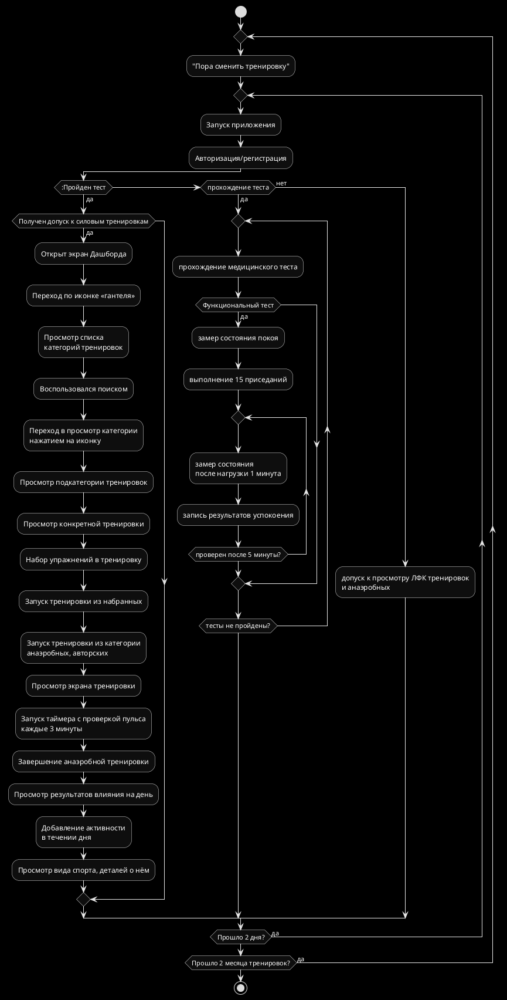

```plantuml

@startuml
skinparam monochrome reverse
start
repeat

:"Пора сменить тренировку";

repeat
:Запуск приложения;


:Авторизация/регистрация;

if (:Пройден тест) then (да)

    if (Получен допуск к силовым тренировкам) then (да)
    :Открыт экран Дашборда;
    :Переход по иконке «гантеля»;
    :Просмотр списка 
    категорий тренировок;
    :Воспользовался поиском;
    :Переход в просмотр категории
    нажатием на иконку;
    :Просмотр подкатегории тренировок;
    :Просмотр конкретной тренировки;
    :Набор упражнений в тренировку;
    :Запуск тренировки из набранных;
    :Запуск тренировки из категории
    анаэробных, авторских;
    :Просмотр экрана тренировки;
    :Запуск таймера с проверкой пульса
    каждые 3 минуты;
    :Завершение анаэробной тренировки;
    :Просмотр результатов влияния на день;
    :Добавление активности
    в течении дня;
    :Просмотр вида спорта, деталей о нём;

    endif

elseif(прохождение теста) then (да)
    repeat 
    :прохождение медицинского теста;

    if(Функциональный тест) then (да)
        :замер состояния покоя;
        :выполнение 15 приседаний;
        repeat
        :замер состояния 
        после нагрузки 1 минута;
        :запись результатов успокоения;
        repeat while(проверен после 5 минуты?)
    endif
    repeat while(тесты не пройдены?)
else(нет)

:допуск к просмотру ЛФК тренировок
и анаэробных;
endif

repeat while (Прошло 2 дня?) is (да)

repeat while (Прошло 2 месяца тренировок?) is (да)

stop

@enduml

```

```plantuml
@startuml
skinparam monochrome reverse

card walk [
Ходьба
----
Параметры
====
— Количество шагов
— Количество километров
— Количество минут
— Средний пульс
....
Сохранить
] 

@enduml

@startsalt

skinparam monochrome reverse

{
    Заголовок экрана
    Описание о ходьбе
    Количество километров    | "    3    "
    Количество минут | "         "
    Средний пульс в ударов минуту | "         "
    [Назад] | [ Добавить в день   ]
}
@endsalt
```

```plantuml
@startuml activity-diagram

skinparam monochrome reverse

database catalog as "Каталог тренировок"
card walk [
Ходьба
----
Параметры
====
— Количество шагов
— Количество километров
— Количество минут
— Средний пульс
....
Сохранить
] 

interface run as "Бег"
interface charging as "Зарядка"

catalog -- walk : шаги/мин + пульс
catalog -- run : км/мин + пульс
catalog -- charging :  в шт.

node aero as "Аэробные"
    catalog == aero

        node updown as "сверху-вниз"
            interface updown_train1 as "Тренировка 1-4"
            aero == updown
                updown -- updown_train1

        node problem as "проблемные зоны"

            interface train1 as "Тренировка 1-7"
            aero == problem
                problem -- train1

node strong as "Силовые"

    catalog == strong
    node strong_woman as "Для женщин"
    node strong_man as "Для мужчин"

    strong == strong_woman

        node strong_hand as "руки"
            interface strong_hand_trains as "Упражнение 1-21"
                strong_hand -- strong_hand_trains

        node strong_shoulders as "плечи"
            interface strong_shoulders_trains as "Упражнение 1-17"
                strong_shoulders -- strong_shoulders_trains

        node strong_cheast as "грудь"
            interface strong_cheast_trains as "Упражнение 1-14"
                strong_cheast -- strong_cheast_trains
        node strong_back as "спина"
            interface strong_back_trains as "Упражнение 1-20"
                strong_back -- strong_back_trains
        node strong_legs as "ноги"
            interface strong_legs_trains as "Упражнение 1-18"
                strong_legs -- strong_legs_trains
        node strong_pop as "ягодицы"
            interface strong_pop_trains as "Упражнение 1-10"
                strong_pop -- strong_pop_trains
        node strong_core as "живот"
            interface strong_core_trains as "Упражнение 1-15"
                strong_core -- strong_core_trains
        strong_woman == strong_hand
        strong_woman == strong_shoulders
        strong_woman == strong_cheast
        strong_woman == strong_back
        strong_woman == strong_legs
        strong_woman == strong_pop
        strong_woman == strong_core

        strong == strong_man

            node strong_hand_man as "руки"
                interface strong_hand_trains_man as "Упражнение 1-21"
                    strong_hand_man -- strong_hand_trains_man
            node strong_shoulders_man as "плечи"
                interface strong_shoulders_trains_man as "Упражнение 1-17"
                    strong_shoulders_man -- strong_shoulders_trains_man
            node strong_cheast_man as "грудь"
                interface strong_cheast_trains_man as "Упражнение 1-14"
                    strong_cheast_man -- strong_cheast_trains_man
            node strong_back_man as "спина"
                interface strong_back_trains_man as "Упражнение 1-20"
                    strong_back_man -- strong_back_trains_man
            node strong_legs_man as "ноги"
                interface strong_legs_trains_man as "Упражнение 1-18"
                    strong_legs_man -- strong_legs_trains_man
            node strong_pop_man as "ягодицы"
                interface strong_pop_trains_man as "Упражнение 1-10"
                    strong_pop_man -- strong_pop_trains_man
            node strong_core_man as "живот"
                interface strong_core_trains_man as "Упражнение 1-15"
                    strong_core_man -- strong_core_trains_man
            strong_man == strong_hand_man
            strong_man == strong_shoulders_man
            strong_man == strong_cheast_man
            strong_man == strong_back_man
            strong_man == strong_legs_man
            strong_man == strong_pop_man
            strong_man == strong_core_man

node sport as "Спортивный досуг"
    interface item1 as "Айкидо"
    interface item2 as "Академическая гребля"
    interface item3 as "Американский футбол"
    cloud item4 as "и др. 69 шт."

catalog == sport         

    sport -- item1
    sport -- item2
    sport -- item3
    sport ~~ item4


interface home as "Активная бытовая нагрузка"

catalog == home

@enduml


```

```plantuml


```