# Проектная документация проекта «Просто, ЗОЖ», Draft

# Полный перечень экранов

   ## 1. Экраны авторизации
      1. Регистрация
      2. Авторизация
      3. Восстановление пароля

2. с 15.00 — 17.00
- ограничения навигации внутри приложения

         ## 5. Сквозная навигация по приложению
         1. Таббар
         2. Сэндвич меню

         ## 6. Dashboard screen: данные из основных разделов приложения
            1. Общая шкала состояния на **СЕГОДНЯ** 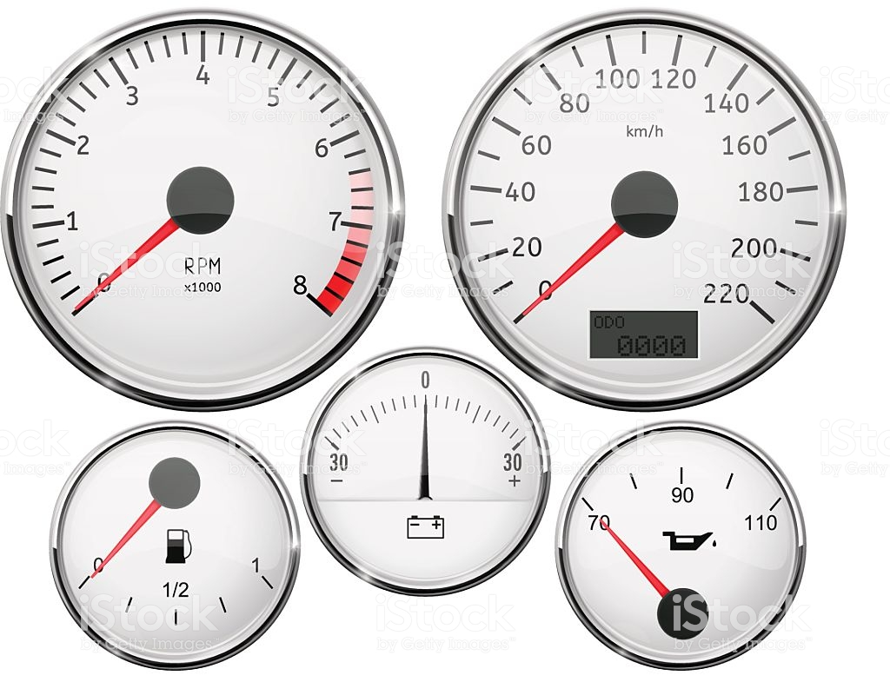
            2. *Нужно получить материалы о том, как конкретный спидометр называется, какая шкала у каждого из них от Авторов*
            3. Переходы на разделы:
               1. Еда и вода
               2. Тренировки
               3. Жизнь
               4. Обучение
                  ## 7. Экран «Еда»
                  - Кнопка «Чего сегодня съедено/выпито?»
                     - Ввод названия продукта с автоподсказкой из каталога
                     - Ввод кол-ва порций употребленного продукта
                  - Помощь с пояснениями на экране «Отображение сетки элементов и частотности приёма»
                  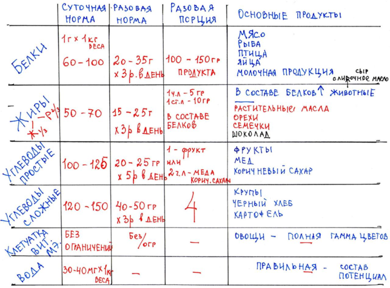
                     - На основе выбранной задачи Пользователя, построение таблицы происходит из программы
                        - Для похудения сокращение объема употребляемой еды
                        - Для поддержания по норме
                        - Для увеличения мышечной массы
                     - Параметры питания задаются из административной панели
                  - Если пользователь где-то упускает или переедает, отображается параметр «ОЙ» на шкале-сетке элементов
                     - Как пить воду
                        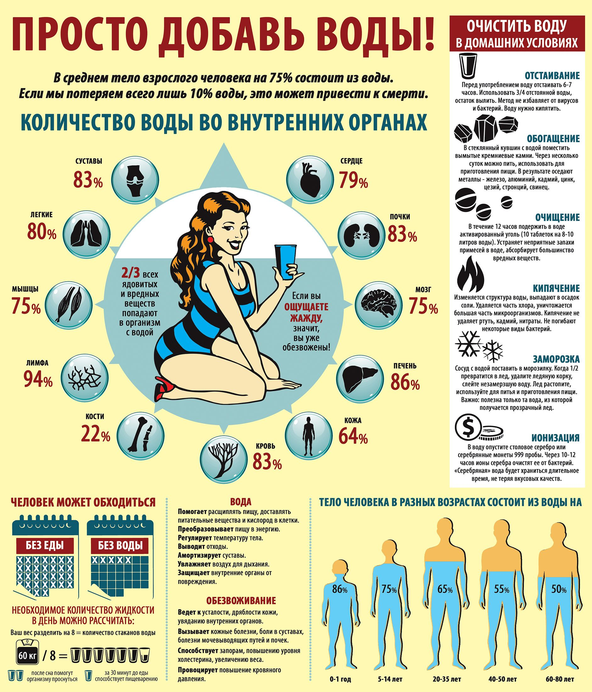
         ## 8. Экран «Движение»
         1. Повседневная нагрузка, моцион
         2. Необходимо указать шагов пройденных
         3. Если не знаете кол-во шагов, укажите сколько времени вы шли пешком. *Приложение автоматически считает кол-во расстояния/шагов из общей средней скорости человка.*
         4. Сколько «двигательных переменок» в течении дня? *Напоминание в течении рабочего дня*
         5. Это могут быть минимум 12-15 минут
            1. Пешком пройтись, размеренно, чтобы не вспотеть
            2. Пешком пройтись, чтобы стало тепло
            3. Желательно на улице
            4. Или размеренно по лестнице в течении 12 минут, чтобы не вспотеть
            5. И не менее 30 минут на свежем воздухе, для получения ультрафиолета
         6. Специальная нагрузка, тренировка
         7. 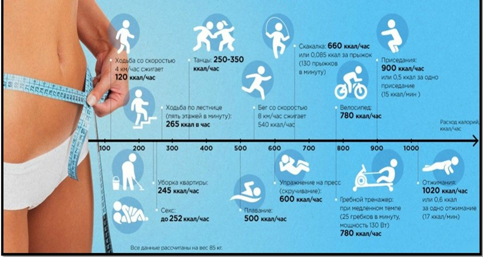
         8. Зоны 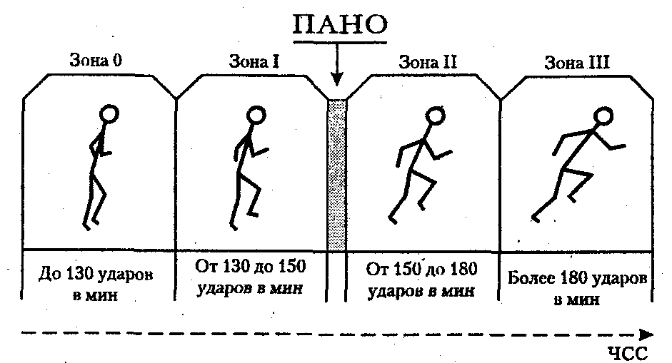 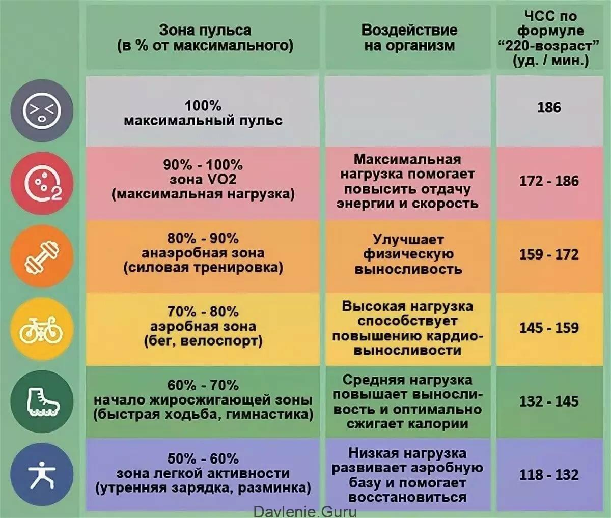
         9. Указать свою тренировку(поставить галочку)
         10. Выбрать тренировку в приложении
            1. Пройти тренировку в приложении

## 1. Экраны авторизации
   1. Регистрация
   2. Авторизация
   3. Восстановление пароля
## 2. Экраны прохождения анкеты-опроса
1. Экран Общие вопросы о пользователе
   1. Пол
   2. Возраст
2. Экран Вопросы об ограничениях медицинских
3. Экран Вопросы о питании
   1. Перечень продуктов и частотность употребления
4. Экран Вопросы по качеству жизни
   1.   Вы курите?
        - эпизодически
        - регулярно
   2. Бывает ли что Вы:
      - страдаете бессонницей?
      - часто пребываете в состоянии стресса? 
      - легко раздражаетесь и выходите из себя в житейских ситуациях? 
      - чувствуете беспричинную тревогу? 
      - опасаетесь за своё здоровье? 
      - быстро утомляетесь? 
      - с трудом входите в необходимый рабочий режим?
    1. Сколько часов вы спите обычно?
       1. Нарисовать часы, выбора стрелки начала и стрелки конца сна
       2. Информация о сне, инфографика
          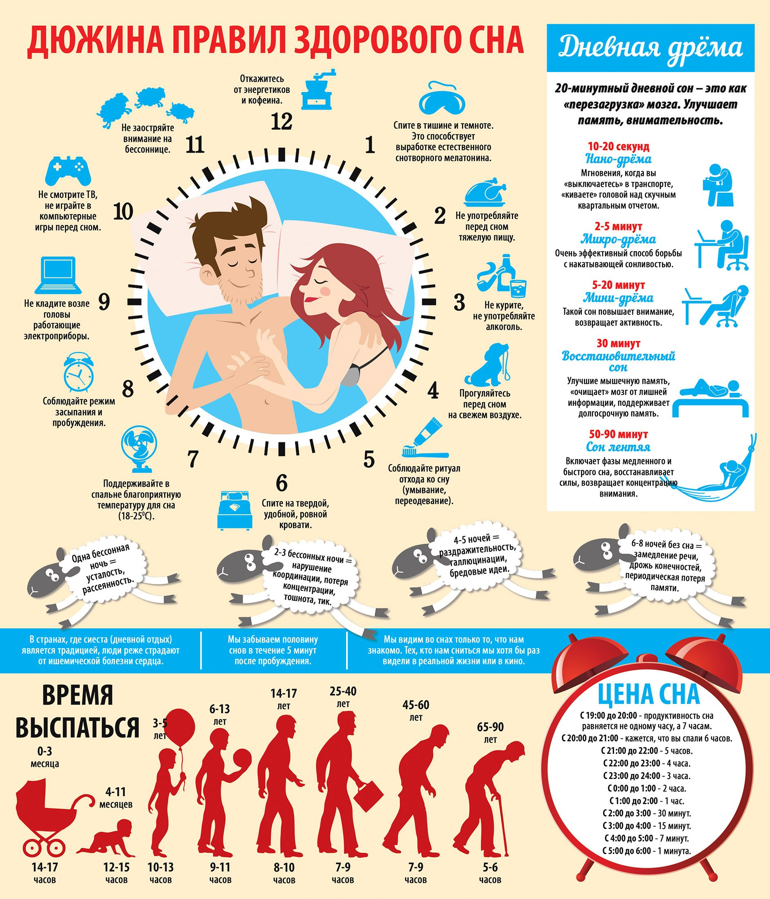
          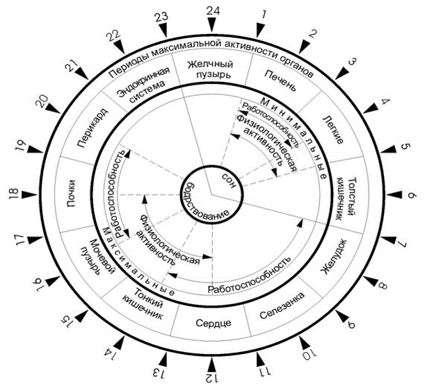
    2. Пользуетесь ли вы будильникам?
       1. Часто
       2. Иногда
       3. Не пользуюсь будильником
    3. Регулярный(ежедневный) ли у вас стул?
       1. Да
          1. В какое время?
             1. Утром
             2. Днём
             3. Вечером
       2. Нет
5. Экран «Вопросы об активности»
   1. Укажите свой вес в КГ
   2. Кол-во упражнений в период времени
      1. Цели которые ставит пользователь перед собой (множественный выбор)
         1. Похудеть
            1. Какой у вас процент жиротложения? 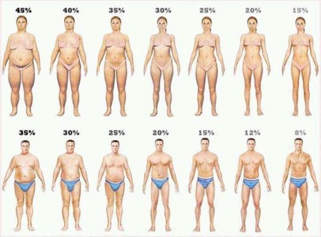
            2. Какая у вас тип жироотложения? 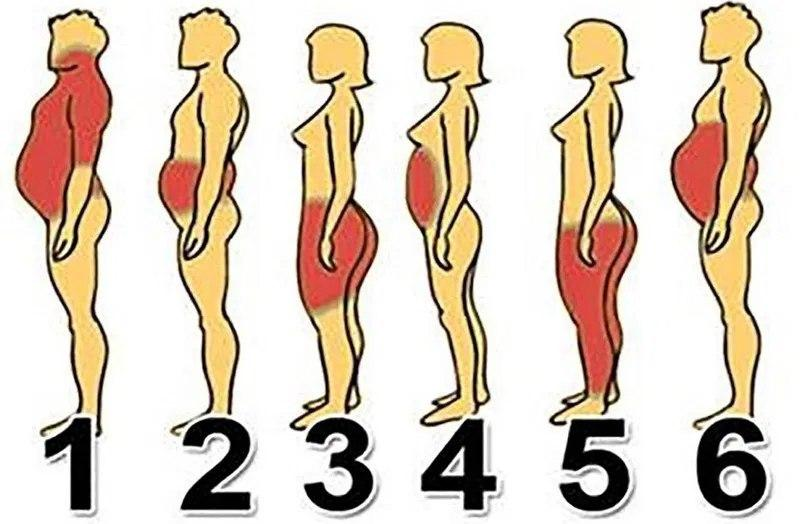
         2. Увеличить мышечную массу(множественный выбор)
            1. Верх
            2. Низ
            3. Сделайте замеры вашего организма 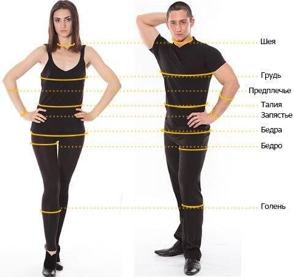
               1. Следующий замер будет через 2 месяца
         3. Повысить уровень здоровья
   3. Функциональный тест
      1. Если пользователь не может его пройти, он пропускает
      2. Не рекомендуем проходить тест, если вы недавно покурили
      3. *Flow*:
         1. Замерьте пульс в покое *15 секунд * 4, и укажите в приложении*
         2. Измерьте давление в покое *после 2-3х минут в покое* (ссылка на видео, как это делать)
         3. Сделайте 20 приседаний, в темпе 1 секунда 1 движение(вниз) 1 секунда(вверх)
         4. Измерьте пульс
         5. Измерьте давление
         6. В конце каждой минуты восстановления после теста, замеряйте пульс и давление до момента полного восстановления
            1. Запуск секундомера для ввода значений
            2. Каждую минуту указывайте пульс
            3. Каждую минуту указывайте верхнее давление
            4. Каждую минуту указывайте нижнее давление
      4. Если пользователь понимает, что прошёл функциональный тест неправильно, то у него есть кнопка прохождения функционального теста «Заново»
## 4. Экран Результаты проведенного теста» 
*Ожидаю от Ирины и Антонины примеры 3х отчетов для потенциальных портретов пользователей*
   1. Краткая сводка: показатели вашего организма
        
   2. Полный отчёт-анализ с рекоммендациями, будет отправлен вам на почту/телефон (если укажет эти данные)
      1. Вместе с отчётом передаются данные для входа в систему:логин и пароль на указанный канал связи
      2. Пример иллюстрации отчёта(это просто пример из другой сферы):
      3. Отчёт уходящий на почту 
         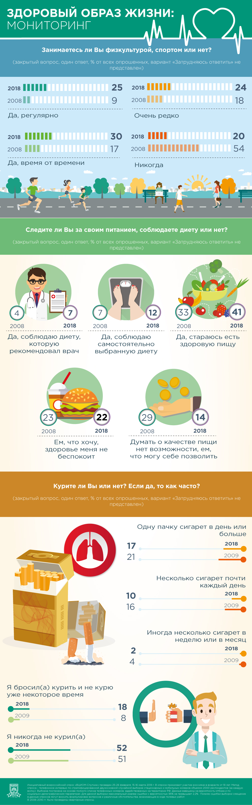
         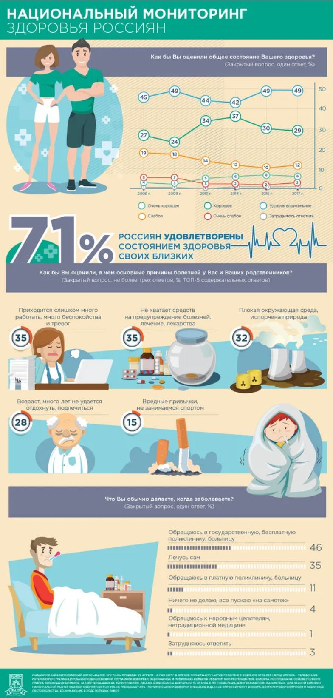
      4. Напоминание о том, как выявлять онкологию
         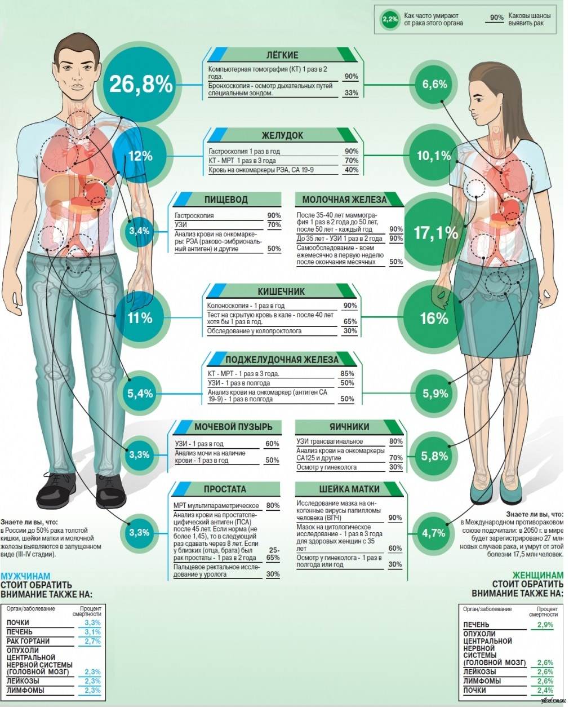
      5. Рекомендуем пройти диспансеризацию
         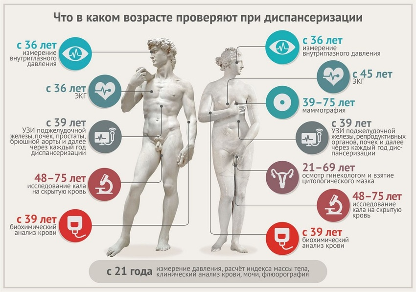
## 5. Сквозная навигация по приложению
   1. Таббар
   2. Сэндвич меню
## 6. Dashboard screen: данные из основных разделов приложения
   1. Общая шкала состояния на **СЕГОДНЯ** 
   2. *Нужно получить материалы о том, как конкретный спидометр называется, какая шкала у каждого из них от Авторов*
   3. Переходы на разделы:
      1. Еда и вода
      2. Тренировки
      3. Жизнь
      4. Обучение
## 7. Экран «Еда»
   - Кнопка «Чего сегодня съедено/выпито?»
     - Ввод названия продукта с автоподсказкой из каталога
     - Ввод кол-ва порций употребленного продукта
   - Помощь с пояснениями на экране «Отображение сетки элементов и частотности приёма»
   
     - На основе выбранной задачи Пользователя, построение таблицы происходит из программы
       - Для похудения сокращение объема употребляемой еды
       - Для поддержания по норме
       - Для увеличения мышечной массы
     - Параметры питания задаются из административной панели
   - Если пользователь где-то упускает или переедает, отображается параметр «ОЙ» на шкале-сетке элементов
     - Как пить воду
       
## 8. Экран «Движение»
   1. Повседневная нагрузка, моцион
      1. Необходимо указать шагов пройденных
      2. Если не знаете кол-во шагов, укажите сколько времени вы шли пешком. *Приложение автоматически считает кол-во расстояния/шагов из общей средней скорости человка.* 
   2. Сколько «двигательных переменок» в течении дня? *Напоминание в течении рабочего дня*
      1. Это могут быть минимум 12-15 минут
         1. Пешком пройтись, размеренно, чтобы не вспотеть
         2. Пешком пройтись, чтобы стало тепло
         3. Желательно на улице
         4. Или размеренно по лестнице в течении 12 минут, чтобы не вспотеть
         5. И не менее 30 минут на свежем воздухе, для получения ультрафиолета
   3. Специальная нагрузка, тренировка
      1. 
      2. Зоны  
      3. Указать свою тренировку(поставить галочку)
      4. Выбрать тренировку в приложении
         1. Пройти тренировку в приложении
##  9.  Экран «Жизнь»
   1. Запрос на получение данных о сне из Apple Health, Google Fit
   2. Укажи сколько было сна сегодня?
      1. На стрелках часов, выбор старт сна 
      2. На стрелках часов указать конец сна
   3. Был ли сон у вас дневной 15 минутный сон?
      1. Да
      2. Нет
   4. Качество вашего сна сегодня:
   5. Опрос по сну, каждый день(качество и здоровье сна)
      1. *Вопросы будут предоставлены от Авторов*
   6. Рекоммендации по режиму дня(их 3 вида: простой, похудение, силовой)
      1. Подъем
      2. Завтрак
      3. Перекус
      4. Обед
      5. Обеденный перерыв
      6. 15 минутный сон
      7. Тренировки
      8. Ужин
      9. Второй ужин, простокваша мечниковская :-)
      10. Сон

      ## 10. Экран «Лента/Обучение»
         1. Сторис
            1. Много изображений
            2. Мало текста
            3. Анимации
            4. Смайлы, обилие
         2. Посты
            1. Статья на 2-3 абзаца
            2. 1-2 изображений
         3. Детальные материалы(лонгриды)
            1. Статья на ∞ абзацев
            2. Обилие изображений
            3. Анимация элементов
            4. Вставки видороликов/2-3 мин
         4. Инфографика
            1. Обилие статистики
            2. Красивая упаковка плоского дизайна, отрисовка в векторе
         5. Видеоролики
            1. Снятые у нас в студии
            2. Найденные и согласованные с авторами в Сети
            3. Видеоролики — не больше 5 минут
         6. Обучающие фильмы
            1. Научные
            2. Познавательные
            3. Фильмы — видеоролик свыше 5 минут уже фильм

      ## 11. Экран «Каталог тренировок»

         1. Поиск глобальный(автокомплиты)
         2. Фильтрация и сортировка
            1. По типу задач
               1. Набор мышечной массы
               2. Похудение
               3. Сохранение и поддержание здоровья
               4. Оздоровительные(ЛФК)
            2. По принципу построения тренировки
               1. Аэробная
                  1. Сверху-вниз
                  2. Проблемные зоны
                  3. Круговая
               2. Силовая
                  1. Верх+середина тела
                  2. Низ+середина тела
                  3. Круговая
         3. Просмотр тренировки
            1. Название тренировки
            2. Видеоматериал тренировки
            3. Краткое описание тренировки
            4. Включить трекинг пульса
               1. Через съём данных с пульсометра
                  1. Работа с API/Bluetooth считывание напрямую к производителю
               2. Снимать не реже чем 1 раз в 5 минут
               3. Проверить считывание через AppleHealth/GoogleFit или других приложений
            5. Выдача результатов и рекомендаций на основе графика динамики пульса в течении тренировки.

      ## 12. Экраны «Справочник продуктов»
         1. Поиск глобальный (автокомлиты)
         2. Фильтрация/сортировка результатов поиска
         3. Категории продуктов
            1. Подкатегории продуктов
         4. Категории необх. элементов
            1. Перечень всех элементов
               1. Просмотр продуктов по элементу
         5. Экран просмотра продукта
            1. Название
            2. Необходимая порция на 1 день
               1. Ладонь
               2. Принцип 4х
               3. Ложки
            3. Вес. Значение динамическое, вычисляется на основе веса указаного пользователем, гендера, роста. В исходной БД лежит всегда по 100гр.
            4. Содержание элементов в указанном весе
               1. Элемент, г
               2. Нутриент, г
               3. Микро, г
               4. Макро, г
               5. Вода, г

      ## 13. Экран «Настройки»
         1. Отключение пуш-уведомлений(в т.ч. на главном экране): отключение по разным типам пуш-уведомлений
         2. Тема: светлая/тёмная
         3. Звук: отключение звуковых схем при нажатии на элементы в разных экранах
         4. Выбор интересующих тем для экрана Ленты
         5. Профиль: редактирование
         6. Доступ по 4х-значному коду: ВКЛ/ВЫКЛ
      ## 14. Экран «Техническая поддержка»
         1. Форма обратной связи
         2. Контакты разработки

      ## 15. Экран «Юридическая/правовая информация»
         1. Документы по обработке персональных данных
         2. Ссылки на литературу и исследования, которые

      ## 16. Экран «О проекте»
         1. Общее описание
         2. Контакты авторов
         3. Информация о разработке проекта

>etc.
>Инфо: Офисные расходы по каллориям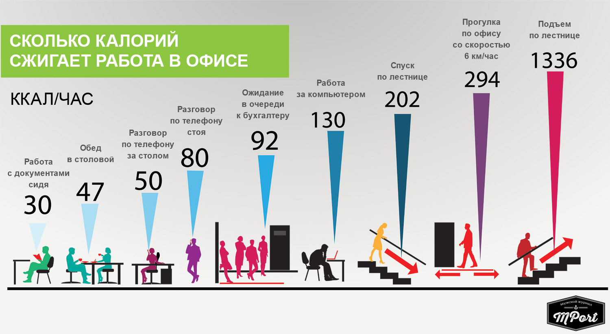