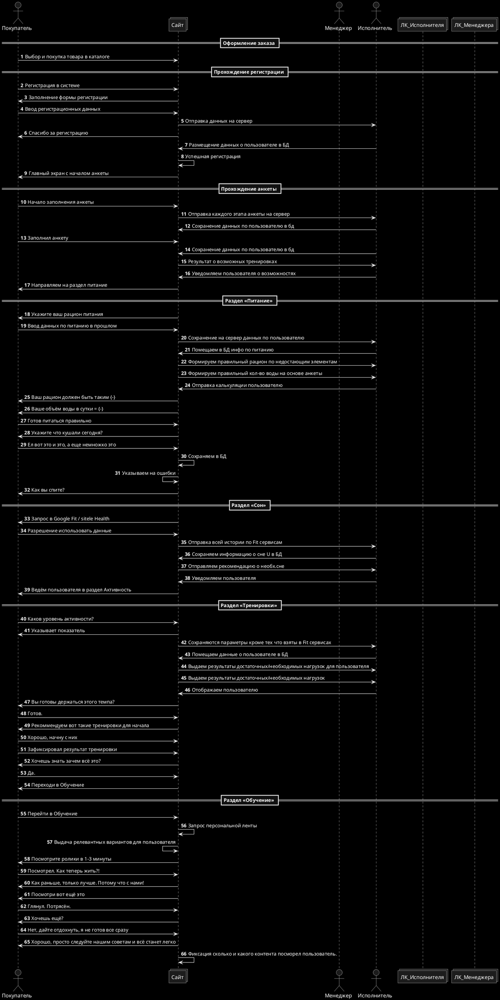
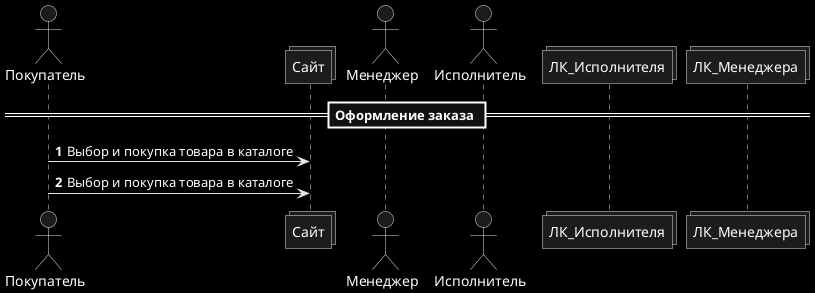

```plantuml

@startuml
'hide footbox
autonumber
!pragma teoz true

skinparam monochrome reverse
'skinparam backgroundColor #272822

actor Покупатель as user
collections Сайт as site
actor Менеджер as manager
actor Исполнитель as booster
collections ЛК_Исполнителя as b_panel
collections ЛК_Менеджера as m_panel

== Оформление заказа ==
user -> site : Выбор и покупка товара в каталоге


== Прохождение регистрации ==
user -> site : Регистрация в системе
site -> user : Заполнение формы регистрации
user -> site : Ввод регистрационных данных
site -> booster : Отправка данных на сервер
site -> user : Спасибо за регистрацию
booster -> site : Размещение данных о пользователе в БД
site -> site : Успешная регистрация
site -> user : Главный экран с началом анкеты
== Прохождение анкеты ==
site <- user : Начало заполнения анкеты
site -> booster : Отправка каждого этапа анкеты на сервер
booster -> site : Сохранение данных по пользователю в бд
site <- user : Заполнил анкету
booster -> site : Сохранение данных по пользователю в бд
booster <- site : Результат о возможных тренировках
site <- booster : Уведомляем пользователя о возможностях
site -> user : Направляем на раздел питание

== Раздел «Питание» ==

site -> user : Укажите ваш рацион питания
site <- user : Ввод данных по питанию в прошлом
site -> booster : Сохранение на сервер данных по пользователю
site <- booster : Помещаем в БД инфо по питанию
site -> booster : Формируем правильный рацион по недостающим элементам
site -> booster : Формируем правильный кол-во воды на основе анкеты
site <- booster : Отправка калькуляции пользователю
site -> user : Ваш рацион должен быть таким {-}
site -> user : Ваше объём воды в сутки = {-}
site <- user : Готов питаться правильно
site -> user : Укажите что кушали сегодня?
site <- user : Ел вот это и это, а еще немножко это
site -> site : Сохраняем в БД
site <- site : Указываем на ошибки
site -> user : Как вы спите?

== Раздел «Сон» ==
site -> user : Запрос в Google Fit / sitele Health
site <- user : Разрешение использовать данные
site -> booster : Отправка всей истории по Fit сервисам
site <- booster : Сохраняем информацию о сне U в БД
site -> booster : Отправляем рекомендацию о необх.сне
site <- booster : Уведомляем пользователя
site -> user : Ведём пользователя в раздел Активность

== Раздел «Тренировки» ==
site <- user : Каков уровень активности?
site -> user : Указывает показатель
site -> booster : Сохраняются параметры кроме тех что взяты в Fit сервисах
site <- booster : Помещаем данные о пользователе в БД
site -> booster : Выдаем результаты достаточных/необходимых нагрузок для пользователя
site -> booster : Выдаем результаты достаточных/необходимых нагрузок
site <- booster : Отображаем пользователю
site -> user : Вы готовы держаться этого темпа?
site <- user : Готов.
site -> user : Рекоммендуем вот такие тренировки для начала

site <- user : Хорошо, начну с них

site <- user : Зафиксировал результат тренировки

site -> user : Хочешь знать зачем всё это?
site <- user : Да.
site -> user : Переходи в Обучение

== Раздел «Обучение» ==

site <- user : Перейти в Обучение
site -> site : Запрос персональной ленты
site <- site : Выдача релевантных вариантов для пользователя
site -> user : Посмотрите ролики в 1-3 минуты
site <- user : Посмотрел. Как теперь жить?!
site -> user : Как раньше, только лучше. Потому что с нами!
site -> user : Посмотри вот ещё это
site <- user : Глянул. Потрясён.
site -> user : Хочешь ещё?
site <- user : Нет, дайте отдохнуть, я не готов все сразу
site -> user : Хорошо, просто следуйте нашим советам и всё станет легко
site -> site : Фиксация сколько и какого контента посморел пользователь.

@enduml
```

```plantuml

@startuml
'hide footbox
autonumber
!pragma teoz true

skinparam monochrome reverse
'skinparam backgroundColor #272822

actor Покупатель as user
collections Сайт as site
actor Менеджер as manager
actor Исполнитель as booster
collections ЛК_Исполнителя as b_panel
collections ЛК_Менеджера as m_panel

== Оформление заказа ==
user -> site : Выбор и покупка товара в каталоге
user -> site : Выбор и покупка товара в каталоге

@enduml
```