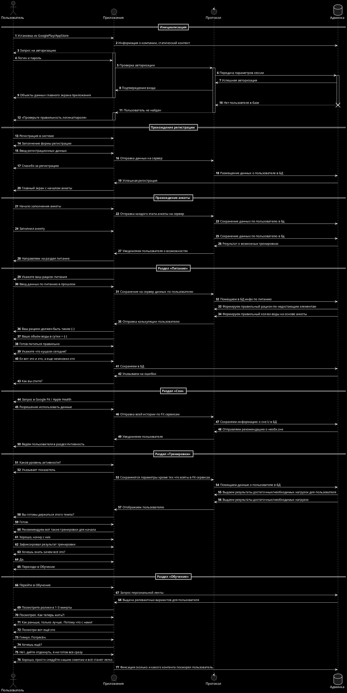

```plantuml

@startuml
'hide footbox
autonumber
!pragma teoz true

skinparam monochrome reverse
'skinparam backgroundColor #272822

actor Пользователь as user
entity Приложения as app
control Протокол as api
database Админка as panel

== Инициализация==
user -> app : Установка из GooglePlay/AppStore
app -> panel: Информация о компании, статический контент
user <-- app : Запрос на авторизацию
activate app
user -> app : Логин и пароль
app -> api : Проверка авторизации
activate api
api -> panel : Передача параметров сессии
activate panel
api <- panel : Успешная авторизация
api -> app : Подтверждение входа
app -> user : Объекты данных главного экрана приложения
deactivate app
api <-- panel : Нет пользовтеля в базе
destroy panel
api --> app : Пользователь не найден
deactivate api
activate app
app -> user: «Проверьте правильность логина/пароля»
deactivate app

== Прохождение регистрации ==
user -> app : Регистрация в системе
app -> user : Заполнение формы регистрации
user -> app : Ввод регистрационных данных
app -> api : Отправка данных на сервер
app -> user : Спасибо за регистрацию
api -> panel : Размещение данных о пользователе в БД
panel -> app : Успешная регистрация
app -> user : Главный экран с началом анкеты
== Прохождение анкеты ==
app <- user : Начало заполнения анкеты
app -> api : Отправка каждого этапа анкеты на сервер
api -> panel : Сохранение данных по пользователю в бд
app <- user : Заполнил анкету
api -> panel : Сохранение данных по пользователю в бд
api <- panel : Результат о возможных тренировках
app <- api : Уведомляем пользователя о возможностях
app -> user : Направляем на раздел питание

== Раздел «Питание» ==

app -> user : Укажите ваш рацион питания
app <- user : Ввод данных по питанию в прошлом
app -> api : Сохранение на сервер данных по пользователю
panel <- api : Помещаем в БД инфо по питанию
panel -> api : Формируем правильный рацион по недостающим элементам
panel -> api : Формируем правильный кол-во воды на основе анкеты
app <- api : Отправка калькуляции пользователю
app -> user : Ваш рацион должен быть таким {-}
app -> user : Ваше объём воды в сутки = {-}
app <- user : Готов питаться правильно
app -> user : Укажите что кушали сегодня?
app <- user : Ел вот это и это, а еще немножко это
app -> panel : Сохраняем в БД
app <- panel : Указываем на ошибки
app -> user : Как вы спите?

== Раздел «Сон» ==
app -> user : Запрос в Google Fit / Apple Health
app <- user : Разрешение использовать данные
app -> api : Отправка всей истории по Fit сервисам
panel <- api : Сохраняем информацию о сне U в БД
panel -> api : Отправляем рекомендацию о необх.сне
app <- api : Уведомляем пользователя
app -> user : Ведём пользователя в раздел Активность

== Раздел «Тренировки» ==
app <- user : Каков уровень активности?
app -> user : Указывает показатель
app -> api : Сохраняются параметры кроме тех что взяты в Fit сервисах
panel <- api : Помещаем данные о пользователе в БД
panel -> api : Выдаем результаты достаточных/необходимых нагрузок для пользователя
panel -> api : Выдаем результаты достаточных/необходимых нагрузок
app <- api : Отображаем пользователю
app -> user : Вы готовы держаться этого темпа?
app <- user : Готов.
app -> user : Рекоммендуем вот такие тренировки для начала

app <- user : Хорошо, начну с них

app <- user : Зафиксировал результат тренировки

app -> user : Хочешь знать зачем всё это?
app <- user : Да.
app -> user : Переходи в Обучение

== Раздел «Обучение» ==

app <- user : Перейти в Обучение
app -> panel : Запрос персональной ленты
app <- panel : Выдача релевантных вариантов для пользователя
app -> user : Посмотрите ролики в 1-3 минуты
app <- user : Посмотрел. Как теперь жить?!
app -> user : Как раньше, только лучше. Потому что с нами!
app -> user : Посмотри вот ещё это
app <- user : Глянул. Потрясён.
app -> user : Хочешь ещё?
app <- user : Нет, дайте отдохнуть, я не готов все сразу
app -> user : Хорошо, просто следуйте нашим советам и всё станет легко
app -> panel : Фиксация сколько и какого контента посморел пользователь.

@enduml
```
